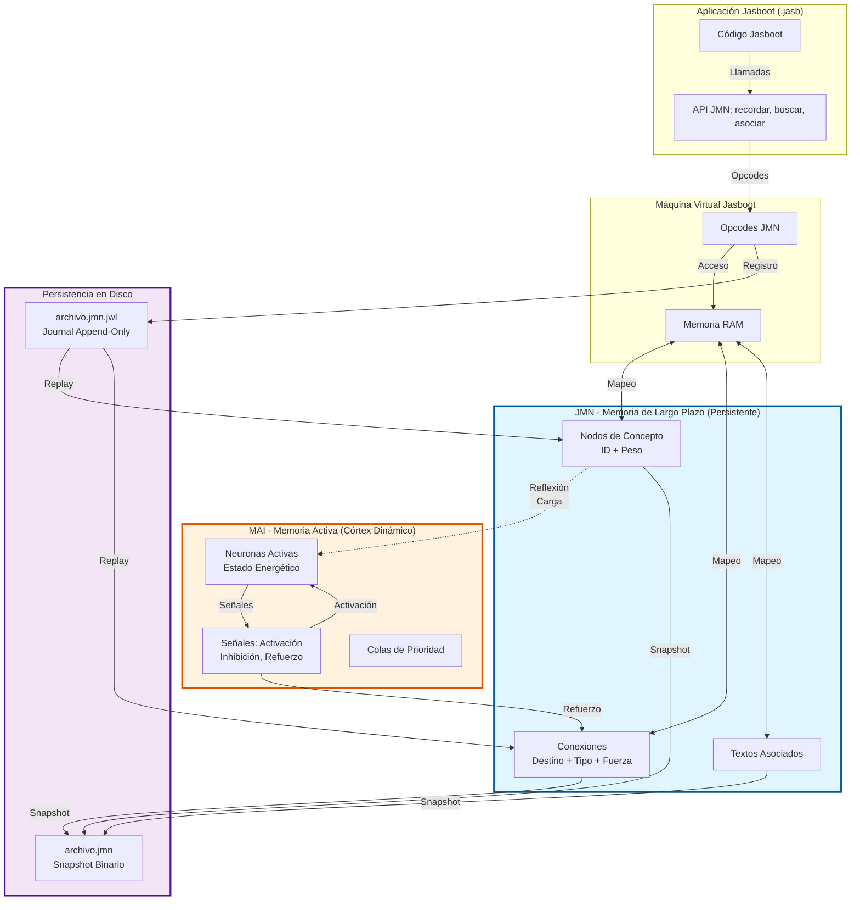
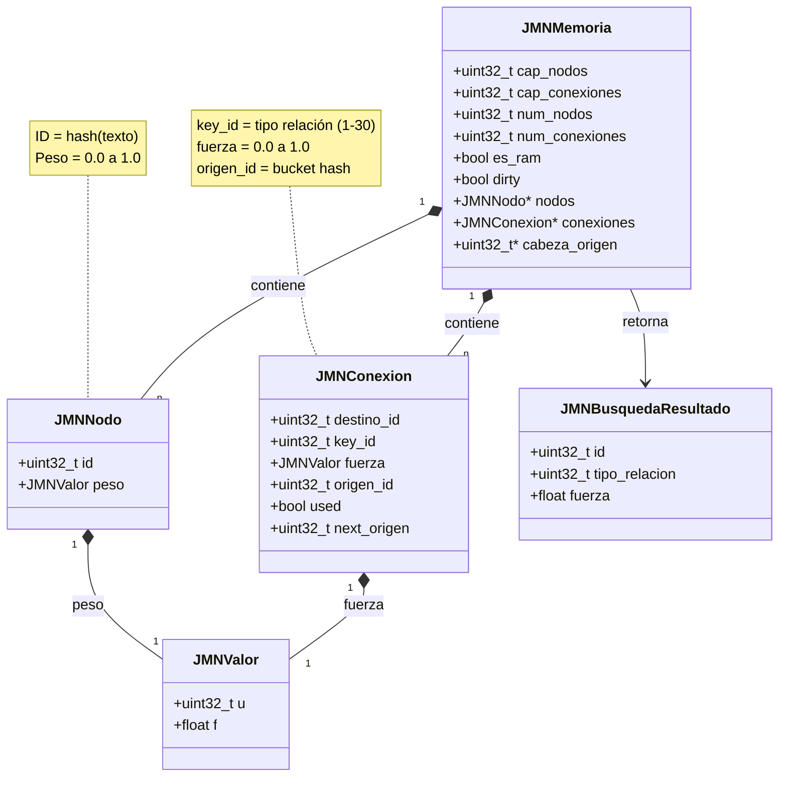
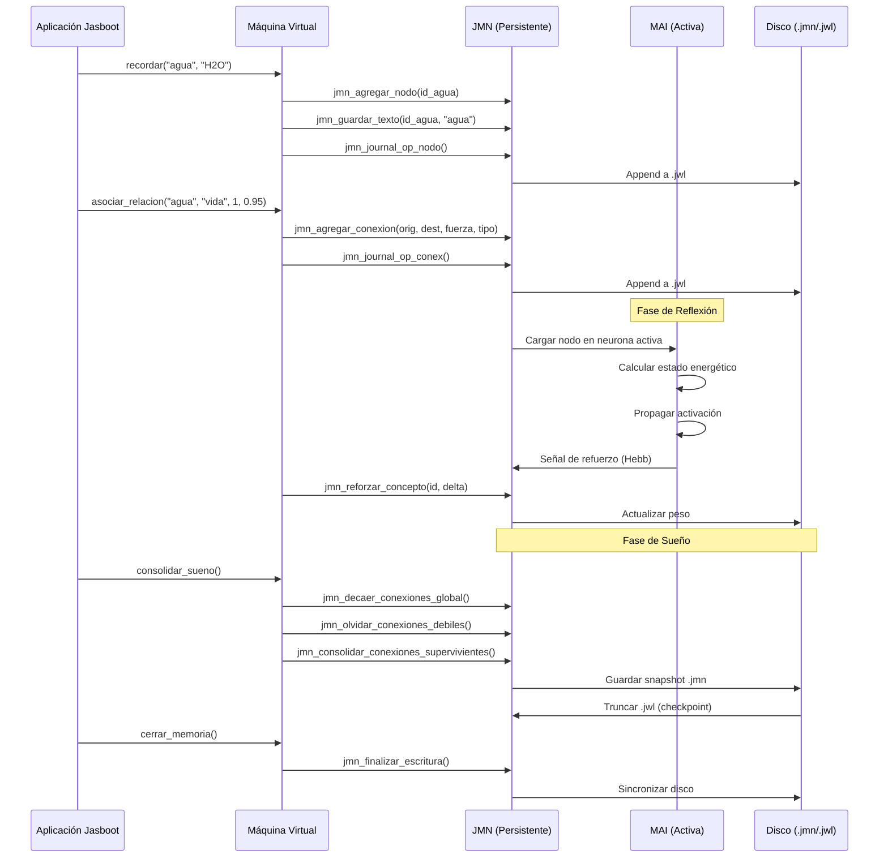
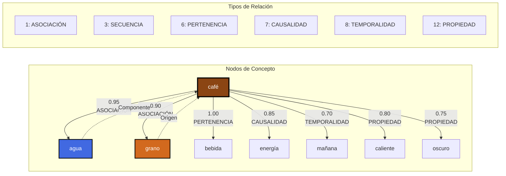
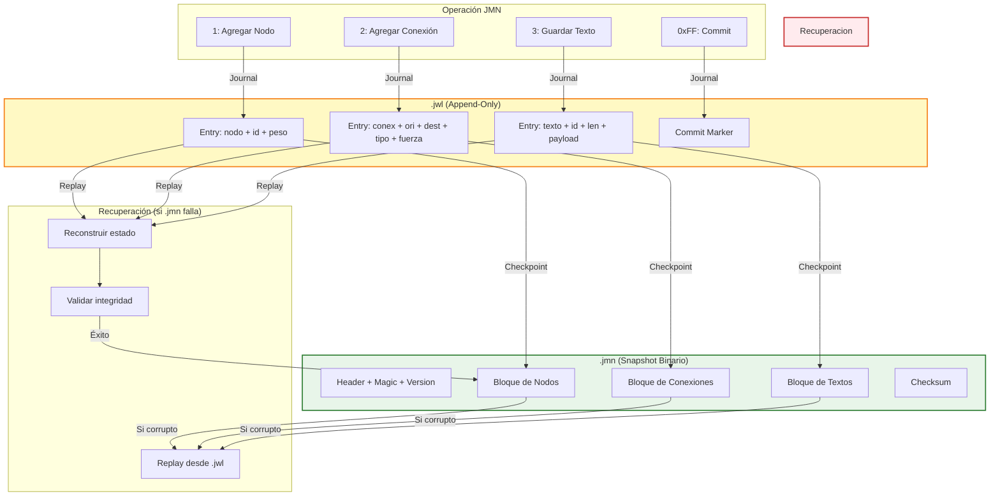
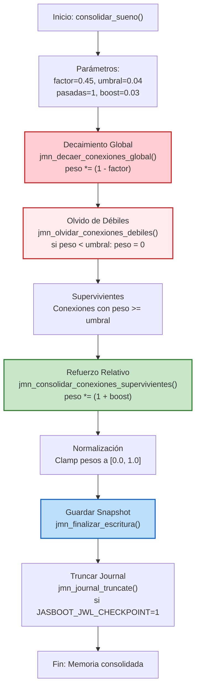
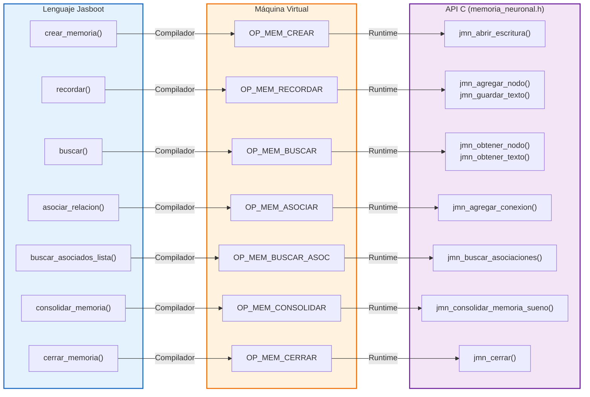
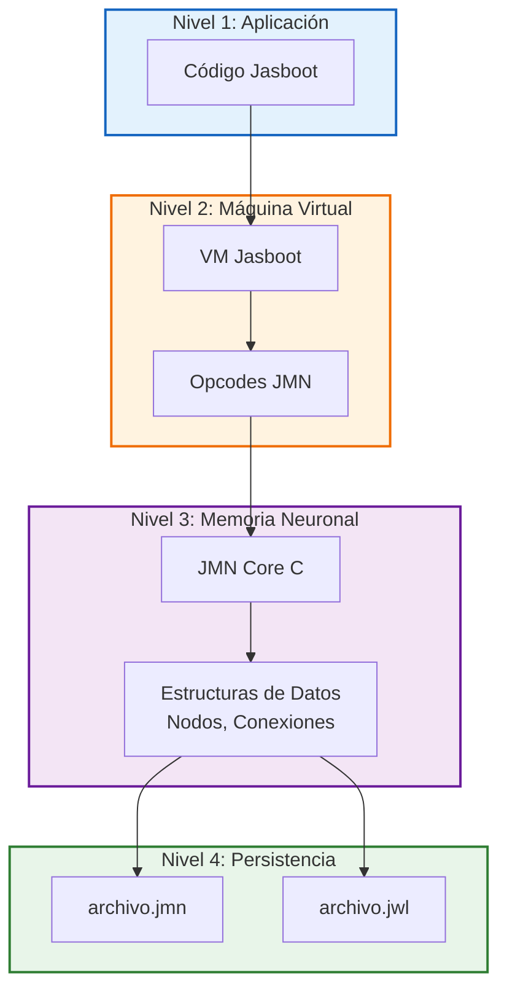

# Diagrama Completo de Conexiones Neuronales en Jasboot

Este documento presenta un diagrama completo en formato Mermaid de la arquitectura de conexiones neuronales en el lenguaje Jasboot, incluyendo la estructura de datos, tipos de relación y flujo de información.

---

## 1. Arquitectura General del Sistema Neuronal



---

## 2. Estructura de Datos C (Nodos y Conexiones)



---

## 3. Taxonomía Completa de los 30 Tipos de Relación

```mermaid
mindmap
  root((Tipos de Relación JMN))
    Semántica Básica
      (1) ASOCIACIÓN
      (2) PATRÓN
      (3) SECUENCIA
      (4) SIMILITUD
      (5) OPOSICIÓN
    Estructura y Taxonomía
      (6) PERTENENCIA
      (13) PARTE_DE
      (16) INSTANCIA
      (23) CALIFICACIÓN
    Causalidad y Lógica
      (7) CAUSALIDAD
      (14) CONSECUENCIA
      (15) CONDICIÓN
      (30) REFERENCIA
    Temporalidad
      (8) TEMPORALIDAD
    Intención y Valor
      (9) INTENCIÓN
      (10) VALORACIÓN
    Espacio y Ubicación
      (11) UBICACIÓN
      (29) SITUACIÓN
    Propiedades y Atributos
      (12) PROPIEDAD
      (20) MAGNITUD
      (21) FRECUENCIA
    Relaciones Sociales
      (17) POSESIÓN
      (22) PARENTESCO
    Funcionalidad
      (18) FUNCIONALIDAD
      (24) ACCIÓN
      (25) COMPLEMENTO
    Evidencia y Medición
      (19) EVIDENCIA
      (26) CUANTIFICACIÓN
      (27) MEDIDA
    Operadores
      (28) OPERADOR
```

---

## 4. Flujo de Información entre Capas (JMN ↔ MAI)



---

## 5. Ejemplo Práctico: Red de Conceptos "Café"



---

## 6. Sistema de Journal y Recuperación



---

## 7. Proceso de Consolidación (Sueño)



---

## 8. Mapeo de Funciones Jasboot → C



---

## 9. Ejemplo Completo: Secuencia de Oración

```mermaid
graph TB
    subgraph Patrón["Neurona Maestra de Patrón"]
        MASTER((Patrón:<br/>"me gusta el café"))
    end

    subgraph Secuencia["Nodos de Secuencia"]
        S1["me"]
        S2["gusta"]
        S3["el"]
        S4["café"]
    end

    subgraph ConexionesHorizontales["Conexiones de Secuencia (Tipo 3)"]
        C1["me → gusta<br/>peso: 0.60"]
        C2["gusta → el<br/>peso: 0.48"]
        C3["el → café<br/>peso: 0.48"]
    end

    subgraph ConexionesVerticales["Conexiones de Patrón (Tipo 2)"]
        V1["Patrón → me<br/>peso: 0.50"]
        V2["Patrón → gusta<br/>peso: 0.50"]
        V3["Patrón → el<br/>peso: 0.50"]
        V4["Patrón → café<br/>peso: 0.50"]
    end

    MASTER -.->|PATRÓN| S1
    MASTER -.->|PATRÓN| S2
    MASTER -.->|PATRÓN| S3
    MASTER -.->|PATRÓN| S4

    S1 -->|SECUENCIA| S2
    S2 -->|SECUENCIA| S3
    S3 -->|SECUENCIA| S4

    style MASTER fill:#9c27b0,stroke:#4a148c,stroke-width:4px,color:#fff
    style Secuencia fill:#e1bee7,stroke:#4a148c,stroke-width:2px
```

---

## 10. Resumen de Arquitectura



---

## Referencias

- **Documentación JMN**: `docs/LENGUAJE/jmn/`
- **Tipos de Relación**: `docs/LENGUAJE/TIPOS_RELACION_JMN.md`
- **API C**: `sdk-dependiente/jasboot-jmn-core/src/memoria_neuronal/memoria_neuronal.h`
- **Estructura Conexiones**: `docs/ESTRUCTURA_CONEXIONES_NEURONALES.md`
- **Journal**: `docs/LENGUAJE/jmn/JMN_JOURNAL_Y_CONSOLIDACION.md`

---

**Fecha de creación**: 2026-05-14  
**Versión**: 1.0  
**Autor**: AI Agent (Cascade)  
**Proyecto**: Jasboot Programming Language
