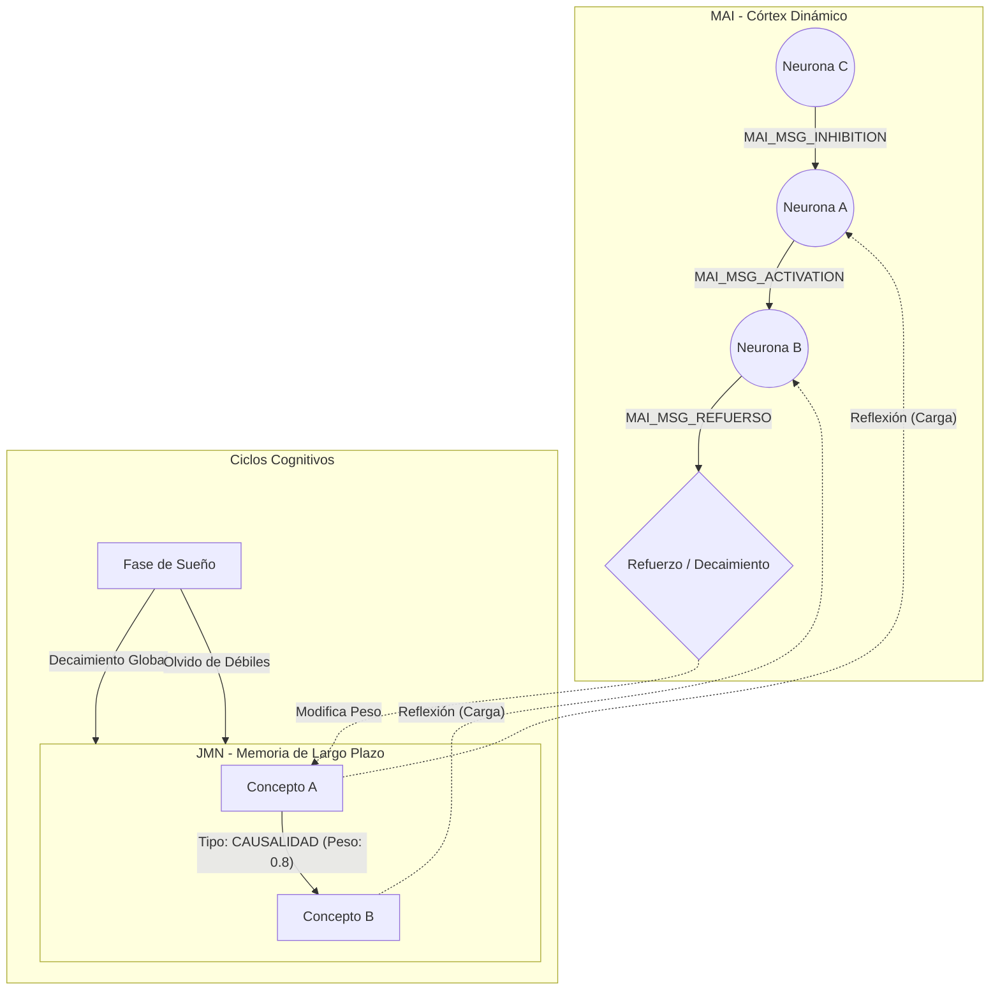
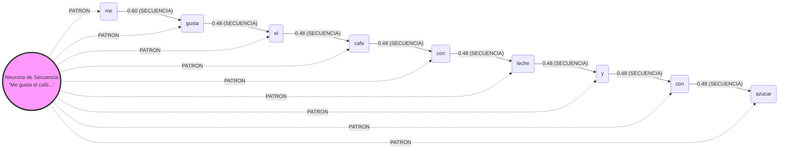

# Estructura de Conexiones Neuronales en Jasboot

Este documento describe la arquitectura de conexiones entre los nodos de conocimiento (JMN) y las neuronas activas (MAI) en el ecosistema Jasboot.

## 1. Visión General de las Capas

Jasboot utiliza una arquitectura de memoria dual para simular procesos cognitivos:

*   **Capa de Persistencia (JMN - Jasboot Memory Neural):** Representa el "conocimiento a largo plazo". Las conexiones aquí son estáticas, pesadas y persistentes en disco (`.jmn`).
*   **Capa de Actividad (MAI - Memoria Activa Independiente):** Representa el "córtex" y el subconsciente inmediato. Las neuronas en esta capa tienen estados energéticos dinámicos y se comunican mediante ráfagas de señales asíncronas.

---

## 2. Conexiones Estáticas (JMN)

En la JMN, una conexión es una arista dirigida entre un nodo de origen y un nodo de destino, caracterizada por un **tipo** y una **fuerza**.

### Estructura de Datos
```c
struct JMNConexion {
    uint32_t destino_id;
    uint32_t key_id;  // Tipo de relación
    JMNValor fuerza;  // Intensidad (0.0 a 1.0)
};
```

### Tipos de Relaciones (Taxonomía)
Jasboot soporta hasta 30 tipos de relaciones predefinidas para estructurar el pensamiento:

| ID | Relación | Descripción |
| :--- | :--- | :--- |
| 1 | ASOCIACIÓN | Vínculo general entre conceptos. |
| 2 | PATRÓN | Reconocimiento de estructuras recurrentes. |
| 3 | SECUENCIA | Orden temporal o lógico (A -> B). |
| 4 | SIMILITUD | Conceptos parecidos o sinónimos. |
| 5 | OPOSICIÓN | Conceptos contrarios o antónimos. |
| 6 | PERTENENCIA | Inclusión en un grupo o categoría. |
| 7 | CAUSALIDAD | Relación causa-efecto. |
| 12 | PROPIEDAD | Atributos de un objeto. |
| 13 | PARTE_DE | Relación mereológica (composición). |
| 14 | CONSECUENCIA | Resultado lógico de una acción. |
| ... | ... | ... (ver `memoria_neuronal.h`) |

---

## 3. Conexiones Dinámicas (MAI)

En la MAI, las conexiones no son aristas fijas, sino **mensajes** que fluyen a través de colas de prioridad.

### Tipos de Señales
*   **Activación (`MAI_MSG_ACTIVATION`):** Aumenta el potencial de la neurona objetivo.
*   **Inhibición (`MAI_MSG_INHIBITION`):** Reduce la energía de la neurona, evitando el disparo.
*   **Refuerzo (`MAI_MSG_REFUERSO`):** Indica a la JMN que incremente la fuerza de la conexión física entre dos nodos.
*   **Sueño (`MAI_MSG_SUEÑO`):** Gatilla procesos de limpieza y consolidación global.

---

## 4. Diagrama de Arquitectura de Conexiones
El siguiente diagrama muestra cómo interactúan las dos capas y cómo fluyen las señales entre neuronas:



---

## 5. Dinámica de las Conexiones

1.  **Reflexión:** Los nodos de la JMN con alta relevancia son "cargados" en la MAI como neuronas activas.
2.  **Propagación:** La activación en una neurona MAI se propaga a sus vecinos en la JMN, multiplicando la energía por la `fuerza` de la conexión estática.
3.  **Plasticidad:** Si dos neuronas MAI se activan frecuentemente de forma simultánea (Regla de Hebb), se envía un mensaje de **Refuerzo** para aumentar el peso en la JMN.
4.  **Entropía (Decaimiento):** Durante el proceso de **Sueño**, las conexiones que no han sido reforzadas pierden fuerza gradualmente hasta desaparecer (olvido).

---

## 6. Ejemplo Práctico: Estructura de una Secuencia Compleja

Para ilustrar cómo Jasboot almacena estructuras lingüísticas o lógicas, consideremos la frase: *"me gusta el café con leche y con azúcar"*.

En este modelo, existe una **Neurona de Patrón** (o Neurona de Conexiones) que supervisa toda la secuencia, manteniendo la coherencia del contexto y las emociones asociadas, mientras que los nodos individuales se conectan secuencialmente.



### Análisis del Ejemplo:
*   **Jerarquía:** La neurona maestra permite que el sistema reconozca la frase completa como una unidad de pensamiento única, incluso si las palabras individuales aparecen en otros contextos.
*   **Pesos Diferenciales:** La conexión `me -> gusta` tiene un peso mayor (0.60), lo que indica una asociación más fuerte o frecuente en el entrenamiento de esta IA.
*   **Flexibilidad:** Gracias a que la maestra usa el tipo `PATRON` (ID 2), el sistema puede activar toda la secuencia simplemente estimulando la neurona maestra (top-down) o reconocer el patrón si se activan varias palabras clave (bottom-up).

---

## 7. Implementación en Código Jasboot

Para crear estas estructuras desde el lenguaje Jasboot, se utilizan las funciones nativas de gestión de memoria neuronal:

```jasboot
principal
    # 1. Crear nodos y conexiones de secuencia
    asociar_relacion("me", "gusta", 3, 0.60)     # 3 = JMN_RELACION_SECUENCIA
    asociar_relacion("gusta", "el", 3, 0.48)
    asociar_relacion("el", "cafe", 3, 0.48)
    
    # 2. Crear la neurona de patrón (maestra)
    texto msg = "me gusta el cafe con leche y con azucar"
    
    # 3. Vincular elementos al patrón
    asociar_relacion(msg, "me", 2, 0.5)         # 2 = JMN_RELACION_PATRON
    asociar_relacion(msg, "gusta", 2, 0.5)
    asociar_relacion(msg, "cafe", 2, 0.5)

    imprimir "Estructura neuronal de secuencia creada."
fin_principal
```

> [!TIP]
> El uso de **hashes** para los IDs de texto permite que `asociar_relacion` sea extremadamente rápido, ya que el lenguaje convierte automáticamente los literales de texto en identificadores numéricos únicos antes de realizar la conexión en la JMN.
