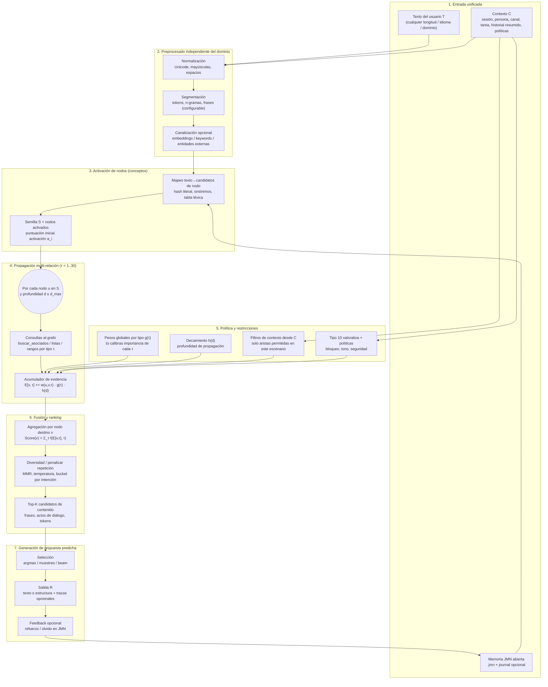
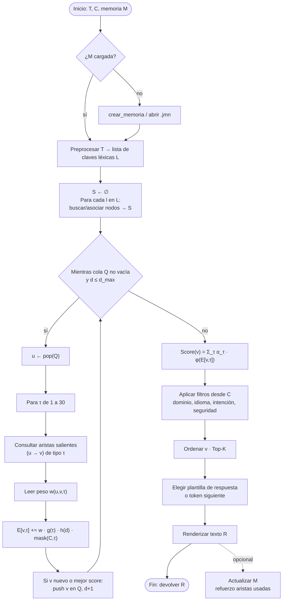

# Modelo mental y algoritmo de procesamiento para predicción de respuestas (JMN, tipos 1–30)

Este documento describe un **modelo mental** y un **algoritmo de procesamiento** agnósticos: sirven para **cualquier texto** y **cualquier contexto** que puedas codificar (metadatos de sesión, usuario, canal, objetivo, memoria previa, etc.). Los **tipos de conexión** coinciden con las constantes del núcleo JMN (`JMN_RELACION_*` … `JMN_RELACION_MAX` = 30 en `sdk-dependiente/jasboot-jmn-core/src/memoria_neuronal/memoria_neuronal.h`).

**Idea clave:** el texto activa **nodos**; cada tipo de arista **aporta un tipo de evidencia** hacia candidatos de respuesta; un **motor de fusión** combina esas evidencias con **pesos de arista** y **pesos de política** (tú los defines) y produce un **ranking** de respuestas o tokens siguientes.

---

## Leyenda rápida (tipos 1–30)

| T | Nombre (macro) | Rol en predicción |
|---|----------------|-------------------|
| 1 | `ASOCIACION` | vecindad semántica amplia |
| 2 | `PATRON` | plantillas / estructuras recurrentes |
| 3 | `SECUENCIA` | “qué sigue” en orden (lenguaje, pasos) |
| 4 | `SIMILITUD` | expansión por equivalencia |
| 5 | `OPOSICION` | contraste / desambiguación |
| 6 | `PERTENENCIA` | taxonomía “es un” |
| 7 | `CAUSALIDAD` | explicación y cadena causa→efecto |
| 8 | `TEMPORALIDAD` | antes/después |
| 9 | `INTENCION` | metas del usuario o del turno |
| 10 | `VALORATIVA` | prioridad ética/estilo/seguridad |
| 11 | `UBICACION` | espacio / lugar |
| 12 | `PROPIEDAD` | atributos |
| 13 | `PARTE_DE` | composición meronímica |
| 14 | `CONSECUENCIA` | inferencia “entonces” |
| 15 | `CONDICION` | prerequisitos |
| 16 | `INSTANCIA` | clase → individuo |
| 17 | `POSESION` | tenencia |
| 18 | `FUNCIONALIDAD` | uso / rol instrumental |
| 19 | `EVIDENCIA` | fuente / confianza |
| 20 | `CUANTIFICACION` | cantidad |
| 21 | `MEDIDA` | unidad / escala |
| 22 | `OPERADOR` | operación simbólica o verbal |
| 23 | `MAGNITUD` | comparación / escala relativa |
| 24 | `FRECUENCIA` | habitualidad / probabilidad léxica |
| 25 | `PARENTESCO` | vínculos sociales/familia/org |
| 26 | `CALIFICACION` | matiz (base + cualificador) |
| 27 | `ACCION` | verbo / proceso |
| 28 | `COMPLEMENTO` | objeto o cierre de predicado |
| 29 | `SITUACION` | marco escénico del turno |
| 30 | `REFERENCIA` | deducción / dependencia lógica |

---

## Diagrama 1 — Flujo global (texto y contexto arbitrarios)

---

## Diagrama 2 — Motor mental: uso de **todos** los tipos de conexión en paralelo

Cada tipo **τ** aporta un canal de evidencia hacia los mismos nodos candidatos `v`. El algoritmo es el mismo para cualquier dominio: solo cambia el **grafo** y los **pesos** almacenados.

```mermaid
flowchart TB
  subgraph INI["Activación"]
    u(("Nodo origen u<br/>(desde texto T)"))
  end

  subgraph T01_05["τ 1–5 · Lexico-semántico"]
    R1["1 ASOCIACION<br/>vecinos semánticos"]
    R2["2 PATRON<br/>plantillas activas"]
    R3["3 SECUENCIA<br/>siguiente en cadena"]
    R4["4 SIMILITUD<br/>expansión equivalente"]
    R5["5 OPOSICION<br/>contraste"]
  end

  subgraph T06_10["τ 6–10 · Mundo y metas"]
    R6["6 PERTENENCIA<br/>taxonomía"]
    R7["7 CAUSALIDAD<br/>cadena explicativa"]
    R8["8 TEMPORALIDAD<br/>orden tiempo"]
    R9["9 INTENCION<br/>objetivo del turno"]
    R10["10 VALORATIVA<br/>prioridad ética/tono"]
  end

  subgraph T11_15["τ 11–15 · Espacio, atributos, lógica"]
    R11["11 UBICACION<br/>lugar"]
    R12["12 PROPIEDAD<br/>atributo"]
    R13["13 PARTE_DE<br/>meronimia"]
    R14["14 CONSECUENCIA<br/>entonces"]
    R15["15 CONDICION<br/>si requisito"]
  end

  subgraph T16_20["τ 16–20 · Entidades, acción, evidencia, cantidad"]
    R16["16 INSTANCIA<br/>individuo concreto"]
    R17["17 POSESION<br/>tenencia"]
    R18["18 FUNCIONALIDAD<br/>para qué sirve"]
    R19["19 EVIDENCIA<br/>confianza / fuente"]
    R20["20 CUANTIFICACION<br/>cuántos"]
  end

  subgraph T21_25["τ 21–25 · Medida, operador, magnitud, frecuencia, social"]
    R21["21 MEDIDA<br/>unidad"]
    R22["22 OPERADOR<br/>operación"]
    R23["23 MAGNITUD<br/>comparación"]
    R24["24 FRECUENCIA<br/>habitualidad"]
    R25["25 PARENTESCO<br/>rol social"]
  end

  subgraph T26_30["τ 26–30 · Cualificación, acción, complemento, situación, referencia"]
    R26["26 CALIFICACION<br/>matiz"]
    R27["27 ACCION<br/>verbo / proceso"]
    R28["28 COMPLEMENTO<br/>objeto / cierre"]
    R29["29 SITUACION<br/>marco escénico"]
    R30["30 REFERENCIA<br/>dependencia lógica"]
  end

  subgraph FUSION["Fusión → Score(v)"]
    F(("Combinar evidencias<br/>peso arista × g(τ) × h(d) × validez(C)"))
    RANK["Ranking global de v"]
  end

  u --> R1
  u --> R2
  u --> R3
  u --> R4
  u --> R5
  u --> R6
  u --> R7
  u --> R8
  u --> R9
  u --> R10
  u --> R11
  u --> R12
  u --> R13
  u --> R14
  u --> R15
  u --> R16
  u --> R17
  u --> R18
  u --> R19
  u --> R20
  u --> R21
  u --> R22
  u --> R23
  u --> R24
  u --> R25
  u --> R26
  u --> R27
  u --> R28
  u --> R29
  u --> R30

  R1 --> F
  R2 --> F
  R3 --> F
  R4 --> F
  R5 --> F
  R6 --> F
  R7 --> F
  R8 --> F
  R9 --> F
  R10 --> F
  R11 --> F
  R12 --> F
  R13 --> F
  R14 --> F
  R15 --> F
  R16 --> F
  R17 --> F
  R18 --> F
  R19 --> F
  R20 --> F
  R21 --> F
  R22 --> F
  R23 --> F
  R24 --> F
  R25 --> F
  R26 --> F
  R27 --> F
  R28 --> F
  R29 --> F
  R30 --> F

  F --> RANK
```

---

## Diagrama 3 — Bucle algorítmico detallado (implementable)

---

## Parámetros que hacen el sistema “universal”

| Parámetro | Qué controla |
|-----------|----------------|
| `L` / tokenización | Cómo se parte **cualquier** texto |
| `d_max` | Hasta qué lejos se propaga en el grafo |
| `g(τ)` | Cuánto pesa cada **tipo** de relación en **este** producto o personalidad |
| `h(d)` | Penalización por distancia (evita explosión combinatoria) |
| `mask(C, τ)` | Desactiva tipos irrelevantes según contexto (p. ej. sin geolocalización, τ 11 bajo) |
| `α_τ` y `φ` | Cómo se combinan canales en un solo score |
| Política sobre τ 10 | Tono, límites, seguridad |

Con eso, el **mismo** diagrama sirve para charla cotidiana, soporte técnico, tutoría o juego narrativo: solo cambian **datos en JMN** y **pesos de política**, no la forma del algoritmo.

---

## Implementación actual (Fases 1–5 Completadas)

A partir de mayo de 2026, el pipeline ARA en Neurixis implementa las primeras 5 fases de forma nativa:

1.  **Fase 1 (Tokenización L)**: Implementada en `modulos/normalizador.jasb`. Soporta limpieza Unicode, normalización de acentos y segmentación léxica.
2.  **Fase 2 (Propagación BFS)**: Ejecutada por el núcleo JMN en C. Controla la expansión mediante `d_max` y el presupuesto de vecinos.
3.  **Fase 3 (Decaimiento h(d))**: Integrado en el opcode `propagar_activacion`. Soporta modelos lineales, exponenciales y sigmoides.
4.  **Fase 4 (Pesos g(τ))**: Configurable mediante `configurar_peso_g(tau, valor)` y perfiles JMN.
5.  **Fase 5 (Máscara mask(C,τ))**: Implementada mediante `configurar_reglas_contexto(json)` y `establecer_contexto(mapa)`. Permite activar/desactivar canales dinámicamente según el modo de operación (geo, math, social, etc.).

---

## Próximos Pasos (Fases 6–8)

- Orden detallado de **implementación** por fases (DoD, pruebas, riesgos): [`../../flujo_model_IA/ORDEN_IMPLEMENTACION_ALGORITMOS.md`](../../flujo_model_IA/ORDEN_IMPLEMENTACION_ALGORITMOS.md).
- Diagramas **por componente** (L, d_max, g, h, mask, α/φ, política τ=10): [`../../flujo_model_IA/README.md`](../../flujo_model_IA/README.md).
- Catálogo descriptivo (documentación): [`TIPOS_RELACION_JMN.md`](./TIPOS_RELACION_JMN.md) (comprueba coherencia numérica con el header si amplías tipos).
- Constantes canónicas: `jasboot-jmn-core` → `memoria_neuronal.h` (`JMN_RELACION_*`, `JMN_RELACION_MAX`).
- Notas de runtime JMN: [`../../sdk-dependiente/docs/JMN_Y_MEMORIA_EN_JASBOOT.md`](../../sdk-dependiente/docs/JMN_Y_MEMORIA_EN_JASBOOT.md).

---

*Documento generado para diagramar el modelo mental y el flujo de predicción; ajusta nombres de primitivas Jasboot (`buscar_asociados`, `buscar_asociados_lista`, rangos, etc.) a tu capa concreta de orquestación.*
