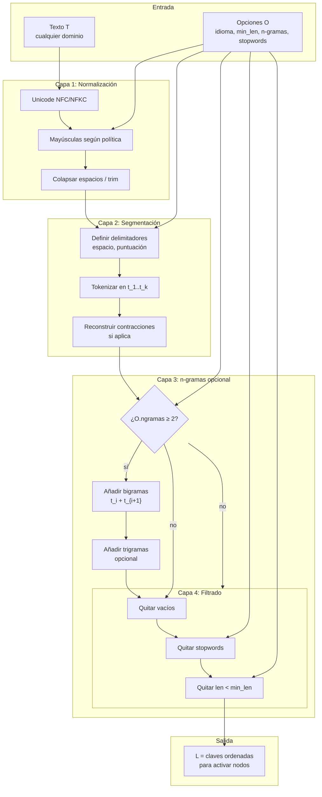
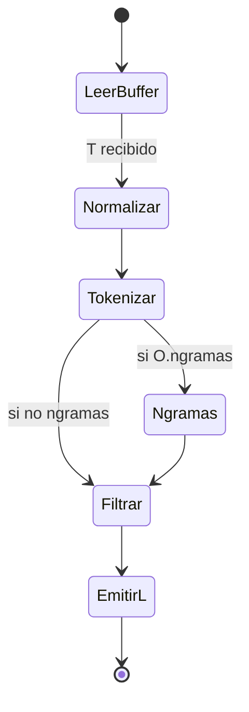

# L — Tokenización y normalización de entrada

**Qué controla:** cómo se parte **cualquier** texto `T` en unidades `L = [ℓ₁, ℓ₂, …]` que luego se mapean a nodos del grafo (literales, claves, n-gramas).

---

## Objetivo

Producir una lista ordenada de **candidatos léxicos** estables ante ruido menor (espacios, mayúsculas) y configurable (idioma, dominio médico vs chat, etc.).

---

## Algoritmo (pipeline en capas)

```
ENTRADA: texto bruto T, opciones O (idioma, min_token_len, usar_ngramas, etc.)

1. NORMALIZAR(T)
   - Unicode NFC o NFKC
   - Opcional: minúsculas para matching de nodos (si el grafo es case-insensitive)
   - Colapsar espacios; trim extremos

2. SEGMENTAR(T_norm, O)
   - Regla A: separadores en blanco y puntuación configurable
   - Regla B: conservar contracciones si O.lo_requiere
   - Salida: lista de tokens t_1..t_k

3. ENRIQUECER (opcional)
   - n-gramas: (t_i, t_{i+1}), trigramas para frases fijas en JMN
   - stemming/lemmatization solo si O activa y existe tabla

4. FILTRAR
   - descartar tokens vacíos o en O.stopwords
   - descartar tokens con longitud < O.min_len

5. MAPEAR_A_CLAVES(L)
   - cada token o n-grama → string clave para buscar/activar nodo en JMN

SALIDA: L = lista de claves [c_1, ..., c_m]
```

---

## Diagrama 1 — Flujo interno completo de L



---

## Diagrama 2 — Máquina de estados mínima (implementación)



---

## Contratos con el resto del modelo

| Salida           | Consumidor                                                          |
| ---------------- | ------------------------------------------------------------------- |
| `L`              | Activación de semillas `S` (cada `c_j` → nodo `u` si existe en JMN) |
| Claves faltantes | Opción: crear nodo efímero o ignorar (política del producto)        |

---

## Pseudocódigo compacto

```text
fun tokenizar(T, O):
    x = normalizar_unicode(T)
    x = politica_mayusculas(x, O.casefold)
    tokens = split(x, O.delimitadores)
    tokens = filtrar_vacios(tokens)
    si O.ngramas >= 2:
        tokens = tokens + bigramas(tokens) + opcional_trigramas(tokens)
    tokens = quitar_stopwords(tokens, O.stopwords)
    tokens = quitar_cortos(tokens, O.min_len)
    retornar tokens   // L
```

---

## Implementación en la VM Jasboot (2026)

En el SDK (`sdk-dependiente/jasboot-ir`), el pipeline L de este documento está implementado en **`vm_tokenizar_l_pipeline.inc`** (`vm_run_tokenizar_L`), invocado por **`OP_STR_DIVIDIR_TEXTO`** con **`IR_INST_FLAG_SAFE`**. En Jasboot las primitivas son **`tokenizar_L`** y **`claves_L`** (alias; firma 1..6 argumentos; registros internos **240** = modo, **241** = `min_len`, **242** = id de texto CSV de stopwords extra, **243** = id de texto CSV de lematización `word=lemma`).

**Paso 1 — `NORMALIZAR`:** utf8proc (formas **NFC, NFD, NFKC, NFKD**; prioridad **NFKC > NFKD > NFC > NFD** si varios bits; **casefold** con el bit **1**), **BOM** (**32768**), **strip** marcas/CC (**16384** / **65536**), colapso Unicode (**131072** + colapsar **2**), plegado Latin lite (**128** si no hay forma 1024…8192), contracciones en buffer (**512**, primera fase), buffer **8192** bytes (`VM_TL_WORK_CAP`).

**Paso 2 — `SEGMENTAR` (Regla A):** delimitadores además de blancos se eligen por bits en **`modo`**: **262144** (**P\***), **524288** (**So**), **1048576** (**Sm**), **2097152** (**Sk**), vía `vm_tl_punctuation_to_space_inplace`; **4194304** ajusta coma entre dígitos ASCII (listas); con **`sep` vacío**, segmentación por blancos con **`vm_tl_utf8_segment_by_whitespace`** o, con **8388608**, por **grupos de grafema** (`vm_tl_utf8_segment_by_whitespace_graphemes`, UAX#29).

**Regla B — S3 contracciones:** con bit **512**, además de las sustituciones en el buffer antes de segmentar, **`vm_tl_contract_merge_adjacent_tokens`** fusiona pares de tokens (`de`+`el`→`del`, etc.) justo después de segmentar.

**Paso 3 — `ENRIQUECER` (Lematización y N-gramas):**

- **Lematización:** Activada con bit **16777216** (`VM_TL_MOD_LEMMA`). Utiliza la tabla CSV cargada en el registro **243**.
- **N-gramas avanzados:** Soporte para bigramas (**4**), trigramas (**16**), cuatrigramas (**67108864** - `VM_TL_MOD_4GRAM`) y pentagramas (**134217728** - `VM_TL_MOD_5GRAM`).

**Paso 5 — `MAPEAR_A_CLAVES`:**

- **Política de Nodos Efímeros:** Activada con bit **33554432** (`VM_TL_MOD_MAP_EXISTING_ONLY`). Si está activo, solo se incluyen en el resultado los tokens que ya existan previamente en la JMN.

Regresión: **`test_tokenizar_L_estres_200.jasb`**, **`test_tokenizar_L_seg_ws_unicode_300.jasb`**, **`test_tokenizar_L_paso2_completo_300.jasb`**, **`test_tokenizar_L_unicode_nfkc.jasb`**, **`test_L_massive.jasb`** (400 casos).

---

## Estado de la Implementación (Mayo 2026)

El pipeline L está **completamente implementado** y verificado para producción.

### Resumen de Capacidades

- **Normalización Multicapa:** Unicode (NFC, NFKC, etc.), colapso de espacios, case folding y plegado de acentos latinos.
- **Segmentación Inteligente:** Soporte para puntuación configurable, símbolos, marcas y segmentación por grafemas (UAX#29).
- **Contracciones:** Fusión de tokens gramaticales (del, al, porque) tanto en pre-procesamiento como post-segmentación.
- **Enriquecimiento Avanzado:**
  - **Lematización:** Soporte para mapeo `palabra=lema` mediante tablas CSV dinámicas.
  - **N-gramas 1-5:** Generación de secuencias de hasta 5 tokens con validación de integridad.
- **Política de Nodos Efímeros:** Filtrado opcional de tokens inexistentes en la JMN para optimización de memoria y relevancia.
- **Robustez:** Suite de 400 casos de prueba cubriendo escenarios de Unicode, puntuación extrema, n-gramas masivos y combinaciones de flags.

### Archivos Clave

- [vm_tokenizar_l_pipeline.inc](file:///c:/src/jasboot/sdk-dependiente/jasboot-ir/src/vm_tokenizar_l_pipeline.inc): Núcleo C de la implementación.
- [codegen.c](file:///c:/src/jasboot/sdk-dependiente/jas-compiler-c/src/codegen.c): Soporte del compilador para firmas de 6 argumentos.
- [test_L_massive.jasb](file:///c:/src/jasboot/tests/production_robustness/test_L_massive.jasb): Suite de validación de 400 casos.
