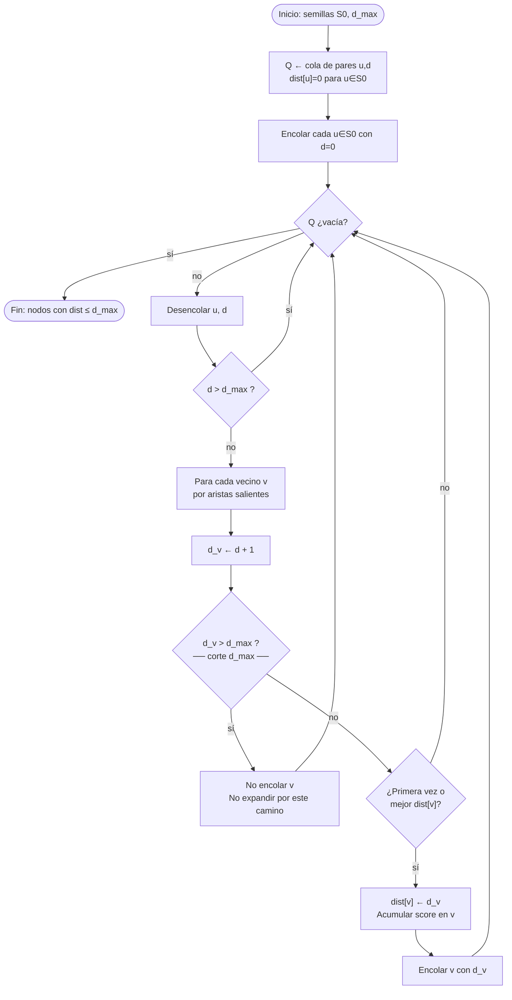
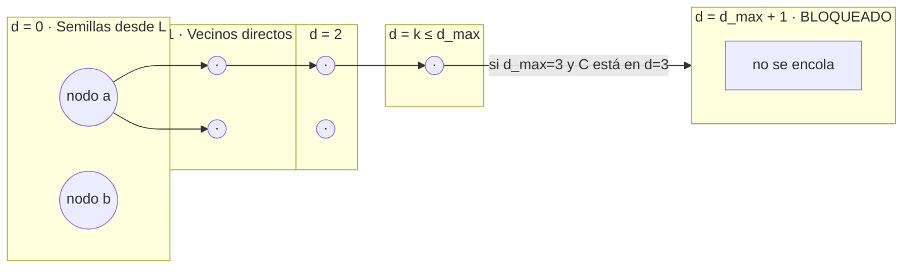
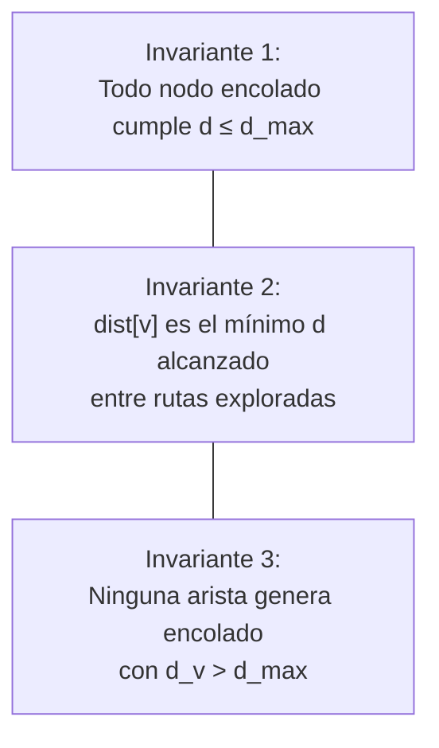

# d\_max — Límite de profundidad en la propagación por el grafo

**Qué controla:** hasta **cuántos saltos** de arista se permite expandir desde cada nodo semilla antes de dejar de encolar vecinos. Evita recorrer el grafo completo y acota el coste.

**Variables:** `d` = profundidad del nodo respecto a la semilla inicial (la semilla tiene `d = 0`).

***

## Definición precisa

- Sea `S₀` el conjunto de nodos activados por el texto (semillas).
- En una expansión tipo BFS, un vecino `v` de un nodo `u` con profundidad `d(u)` recibe profundidad propuesta `d' = d(u) + 1`.
- **Regla d\_max:** solo se acepta encolar `v` si `d' ≤ d_max`.

Si usas DFS, la misma regla aplica al **profundidad de recursión** o al valor `d` guardado en la pila.

***

## Algoritmo — BFS con profundidad (recomendado)

```
ENTRADA: semillas S0, grafo G, d_max ∈ ℕ

Cola Q ← vacía
Mapa dist: nodo → profundidad mínima vista

para cada u en S0:
    dist[u] ← 0
    Q.enqueue(u, 0)

mientras Q no vacía:
    (u, d) ← Q.dequeue()
    si d > d_max: continuar   // defensivo
    para cada arista (u, v, τ, w) saliente respetando mask y tipos activos:
        d_v ← d + 1
        si d_v > d_max:
            continuar          // CORTE PRINCIPAL por d_max
        si v no en dist o d_v < dist[v]:
            dist[v] ← d_v
            acumular evidencia en v con peso ajustado por h(d_v), g(τ), w
            Q.enqueue(v, d_v)

SALIDA: nodos alcanzados con dist[v] ≤ d_max y scores acumulados
```

***

## Diagrama 1 — Flujo interno de d\_max (dónde corta)



***

## Diagrama 2 — Relación d\_max con capas de profundidad



***

## Diagrama 3 — Invariantes (auditoría de implementación)



***

## Elección de d\_max (heurística)

| d\_max | Efecto                                          |
| ------ | ----------------------------------------------- |
| 0      | Solo semillas; sin vecinos                      |
| 1      | Muy local; baja latencia                        |
| 2–4    | Uso típico conversacional                       |
| ≥6     | Razonamiento multi-hop; riesgo de ruido y coste |

***

***

## Estado de la Implementación (Mayo 2026)

La regla **d\_max** está completamente implementada en el SDK (`sdk-dependiente/jasboot-jmn-core`) y expuesta a través de la VM Jasboot.

### Detalles Técnicos y Alcance

- **Algoritmo**: BFS con seguimiento de profundidad por nodo. Garantiza que `dist[v]` es la profundidad mínima (camino más corto) desde cualquier semilla.
- **Límite máximo**: **32 niveles** de profundidad (hard-coded para seguridad y rendimiento). Intentar usar un `d_max` mayor será truncado a 32.
- **Ámbito**: La propagación se detiene inmediatamente cuando un nodo candidato superaría el límite `d_max` respecto a su semilla de origen.

### Reglas de Auditoría

El proceso interno es totalmente auditable mediante variables de entorno:

1. **`JASBOOT_PROPAGAR_AUDIT`**:
   - `0`: Auditoría desactivada (por defecto).
   - `1`: **Resumen**: Imprime en `stderr` la semilla, `d_max`, número de resultados y el mejor nodo alcanzado.
   - `2`: **Detalle de Rastro**: Además del resumen, imprime los primeros N nodos del rastro de activación con su ID, profundidad (`d`), peso (`act`) y texto asociado.
   - `3`: **Debug IR**: Incluye el empaquetado interno de la instrucción para depuración de bajo nivel.
2. **`JASBOOT_PROPAGAR_AUDIT_LIMIT`**: Define cuántos nodos mostrar en el rastro detallado (nivel 2). Por defecto muestra 64.

### Verificación de Robustez

Se ha validado la coherencia del sistema mediante una suite de **300 casos de prueba reales** ([test\_propagar\_dmax\_massive.jasb](file:///c:/src/jasboot/tests/production_robustness/test_propagar_dmax_massive.jasb)), simulando flujos conversacionales con diferentes profundidades y tipos de relación, asegurando que la lógica de corte es precisa y auditable.

### Archivos Relacionados

- [memoria\_neuronal\_cognitivo.c](file:///c:/src/jasboot/sdk-dependiente/jasboot-jmn-core/src/memoria_neuronal/memoria_neuronal_cognitivo.c): Lógica de expansión y corte.
- [vm.c](file:///c:/src/jasboot/sdk-dependiente/jasboot-ir/src/vm.c): Implementación de la auditoría y recolección del rastro con profundidad.

