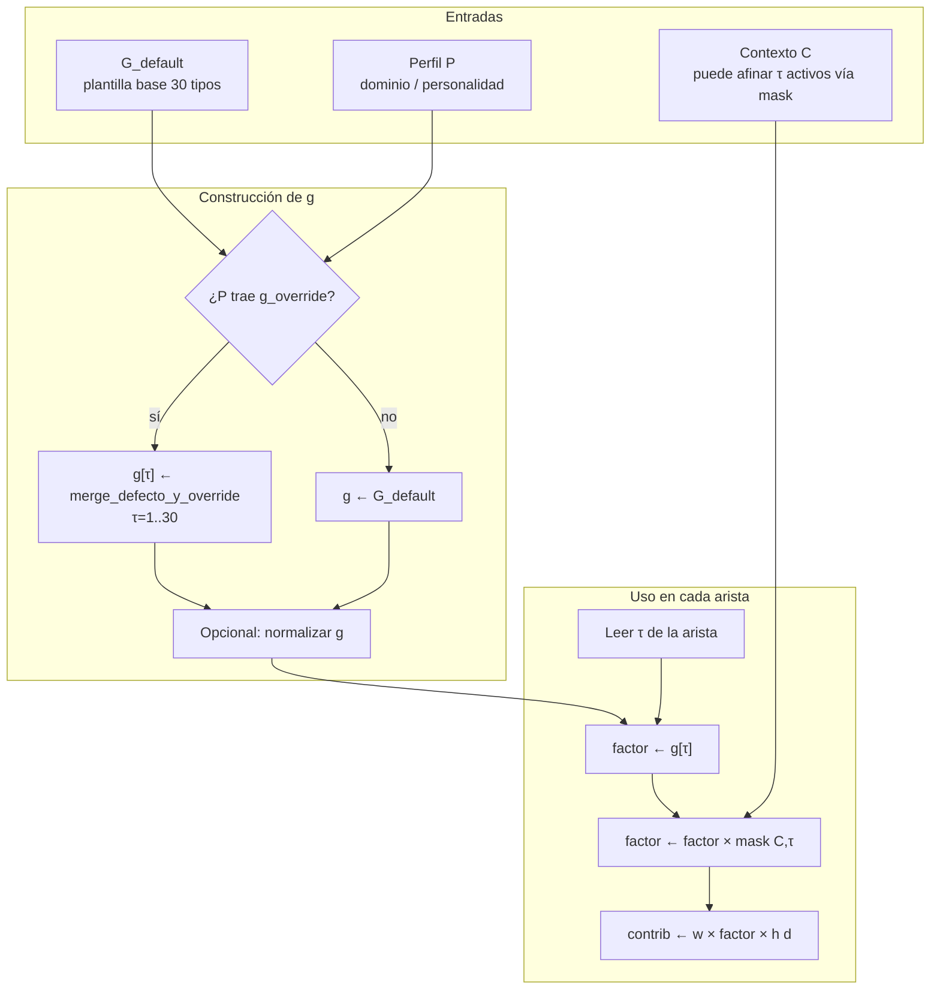
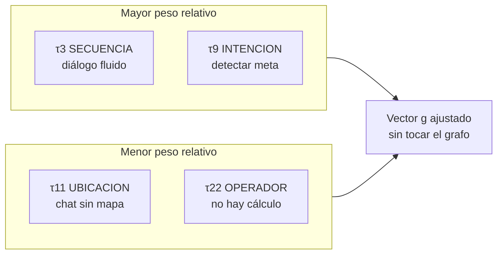

# g(τ) — Peso global por tipo de relación

**Qué controla:** cuánta **influencia** tiene cada tipo de arista `τ ∈ {1,…,30}` al acumular evidencia hacia nodos candidatos, **independiente** del peso `w` almacenado en la arista concreta.

Intuición: el mismo grafo puede comportarse como “más secuencial” o “más asociativo” según el vector `g`.

---

## Definición

- Vector **g** de dimensión 30 (o función `g(τ)` tabulada).
- Contribución típica de una arista `(u,v,τ,w)` a la evidencia en `v`:

  `contrib += w · g(τ) · h(d) · mask(C,τ)`

(donde `h` y `mask` están en otros documentos).

Restricciones recomendadas: `g(τ) ≥ 0`; opcional normalizar `max_τ g(τ) = 1`.

---

## Algoritmo — Carga y aplicación

```
ENTRADA: perfil P (producto, personalidad, tarea), plantilla G_default[1..30]

1. CARGAR(P):
   - si P tiene override por dominio: g ← merge(G_default, P.g_override)
   - si no: g ← G_default

2. NORMALIZAR (opcional):
   - escalar todos los g(τ) por constante K para que la suma o el max queden acotados

3. EN USO (bucle de propagación):
   - al procesar arista de tipo τ:
         factor ← g[τ]
         si mask(C,τ)=0: factor ← 0
         acumular w * factor * h(d) en el score del canal τ o en el agregado

SALIDA: g disponible como tabla en memoria O(1) por lookup
```

---

## Diagrama 1 — Flujo interno: de perfil a tabla g



---

## Diagrama 2 — Calibración por “personalidad” (ejemplo conceptual)



---

## Pseudocódigo

```text
tipo G = vector[1..30] de float

fun construir_g(P, G_default) -> G:
    g = copia(G_default)
    si P.g_override existe:
        para τ en 1..30:
            si P.g_override[τ] definido:
                g[τ] = P.g_override[τ]
    opcional_normalizar(g)
    retornar g

fun factor_arista(g, maskC, τ):
    retornar g[τ] * maskC(τ)
```

---

## Implementación actual en Jasboot (VM + JMN)

Estado respecto a este documento:

| Aspecto de este doc            | En el código                                                                                                                                                                                                         |
| ------------------------------ | -------------------------------------------------------------------------------------------------------------------------------------------------------------------------------------------------------------------- |
| Tabla **`g[1..30]`**           | **`JMNPropagarExtra.g_tau`** en JMN; copia de trabajo en **`VM.g_extra`** (`vm.c`). Índice **`τ`** alineado con **tipos JMN 1…30**.                                                                                  |
| **`mask(C,τ)`** multiplicativa | **`JMNPropagarExtra.mask_tau`**, mismo rango; **`jmn_propagar_factor_arista`** = **`g[τ]·mask[τ]`** (con saneos 0…1 en máscara).                                                                                     |
| Perfil **`P`**                 | Builtin **`cargar_perfil_g(nombre)`** (nombrados) o **`cargar_perfil_g_archivo(ruta)`** (fichero con pares `τ peso`).                                                                                                |
| Overrides **`g`**              | **`configurar_peso_g(τ, flotante)`**, **`configurar_pesos_g(lista)`**.                                                                                                                                               |
| Decaimiento **`h(d)`**         | **`configurar_h_modo(int)`** (0..3), **`configurar_h_lambda(flotante)`**, **`configurar_h_kappa(flotante)`**. Integrado en **`JMNPropagarExtra`**.                                                                   |
| Normalizar **`g`**             | **`normalizar_pesos_g()`** → **`jmn_propagar_extra_normalizar`**.                                                                                                                                                    |
| Uso en arista **`w·g·h·mask`** | En **`jmn_propagar_activacion_semillas`**, la contribución usa **`fuerza_arista * h(d) * jmn_g_mul(extra, τ)`** (equivalente al factor **`w·g·mask`** de este doc; **`h`** documentado en [`04_h_d.md`](04_h_d.md)). |
| Variables de entorno           | **`JASBOOT_PROPAGAR_G`**, **`JASBOOT_PROPAGAR_MASK`** (listas que sobrescriben tabla tras defaults); resto en **`AGENTS.md`**.                                                                                       |

### API Jasboot (builtins)

- **`configurar_peso_g(tau, peso)`**
- **`configurar_pesos_g(lista)`** — hasta **30** entradas flotantes para **`τ=1..30`**
- **`normalizar_pesos_g()`**
- **`cargar_perfil_g(nombre_perfil)`**
- **`cargar_perfil_g_archivo(ruta)`**
- **`configurar_mascara_g(tau, valor_0_a_1)`**
- **`configurar_mascaras_g(lista)`**
- **`configurar_h_modo(modo)`** — 0=lineal, 1=exp, 2=sigmoide, 3=paso
- **`configurar_h_lambda(valor)`** — decaimiento (típico 0.7)
- **`configurar_h_kappa(valor)`** — forma (típico 0.15)
- **`configurar_auditoria_ia(modo)`** — 0=apagado, 1=resumen, 2=detallado (por arista)
- **`obtener_auditoria_ia_json()`** — Retorna una lista JSON con las últimas 32 auditorías realizadas.

---

## Auditoría y Trazabilidad

Para auditar el comportamiento interno del motor de propagación, utiliza `configurar_auditoria_ia` y extrae los resultados en formato JSON para su análisis programático.

### Ejemplo de Auditoría JSON

```jasboot
principal
    configurar_auditoria_ia(2) // Detallado
    propagar_activacion("raiz", 2, 10)

    // Obtener log como objeto JSON
    auditoria = obtener_auditoria_ia_json()

    // Ahora puedes procesar los datos segun necesites
    imprimir "Se auditaron " + json_lista_tamano(auditoria) + " llamadas."

    // Ejemplo de estructura JSON generada:
    // [
    //   {
    //     "origen": 101,
    //     "d_max": 2,
    //     "n_resultados": 5,
    //     "rastro": [
    //       {"id": 202, "d": 1, "act": 0.8, "txt": "ejemplo"},
    //       ...
    //     ]
    //   }
    // ]
fin_principal
```

La auditoría permite verificar:

1.  **g(τ)**: Si el peso por tipo de relación se está aplicando correctamente.
2.  **h(d)**: Si el decaimiento por distancia sigue la curva esperada.
3.  **Umbrales**: Por qué ciertos nodos no están siendo alcanzados (filtrado por `na < umb`).

### Cobertura de tests

- Estrés **≥400** iteraciones ( **`g`**, máscara **`τ=11`**, perfiles, lista **`g`** ): **`tests/test_ia_g_tau_stress_400.jasb`**.
- **Neurixis** (`apps/neurixis/`): **`neurixis_pipeline_g_tau_ara()`** en `modulos/generador.jasb` — tras **`crear_memoria`** y antes de cada **`activar_propagacion_contextual`** / **`inyectar_ancla_contextual`**.

### Qué **no** está como en [`06_alpha_phi.md`](06_alpha_phi.md)

La propagación actual devuelve un **ranking escalar** de nodos (mejor activación agregada); **no** mantiene una matriz **`E[v,τ]`** ni una fusión explícita **`φ`** por canal en cada nodo. El multiplicador **`g·mask`** sí está aplicado **por arista** antes de acumular score.

### Nota técnica (compilador ↔ VM)

Los **bits de flags IR** del compilador deben ser los mismos que en **`jasboot-ir/src/ir_format.h`** (`sdk-dependiente/jas-compiler-c/include/opcodes.h`). Si divergen, **`propagar_activacion`** puede interpretarse como rama MAI (`RELATIVE`) y dar **`n_out=0`**.

---

## Contratos

| Entrega    | Uso                                                         |
| ---------- | ----------------------------------------------------------- |
| `g[1..30]` | Multiplicador por tipo antes de `α_τ` y `φ` en fusión final |

Ver fusión en [`06_alpha_phi.md`](06_alpha_phi.md) y contexto en [`05_mask_C_tau.md`](05_mask_C_tau.md).
