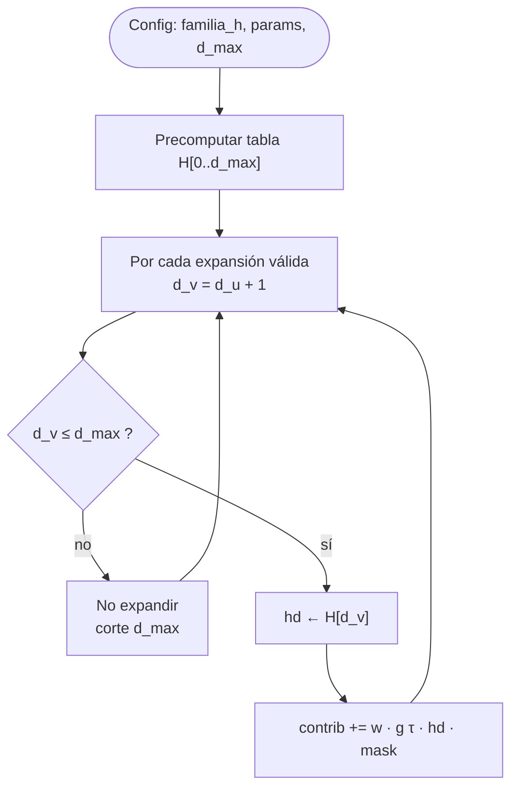
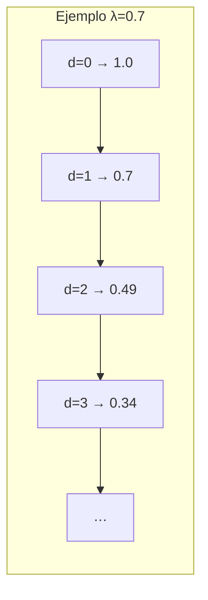
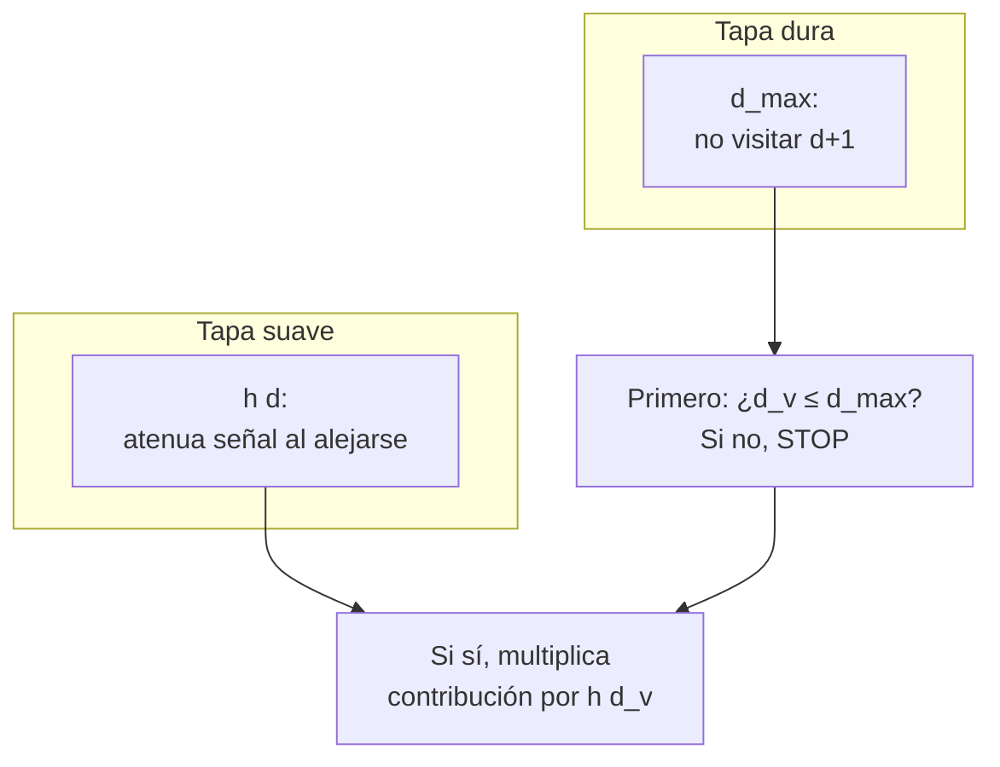

# h(d) — Penalización (o ganancia) por distancia en el grafo

**Qué controla:** cómo decae (o crece) la **intensidad** de la señal cuando la arista se usa a profundidad `d` respecto a la semilla. Complementa a **d_max** (corte duro): `h` suaviza dentro del rango `0..d_max`.

---

## Familias habituales de h(d)

1. **Exponencial:** `h(d) = λ^d` con `0 < λ < 1` (cuanto más lejos, menos peso).
2. **Lineal:** `h(d) = max(0, 1 - d / (d_max + 1))`.
3. **Paso constante hasta el borde:** `h(d) = 1` si `d ≤ d_k`, luego cae.
4. **Inversa:** `h(d) = 1 / (1 + κ·d)` con `κ > 0`.

En todos los casos, si `d > d_max`, **no** deberías aplicar `h` porque el nodo no se expande (ver [`02_d_max.md`](02_d_max.md)).

---

## Algoritmo — Precomputación + lookup

```
ENTRADA: función_h, parámetros (λ, κ, d_max)

1. PRECOMPUTAR_TABLA:
   tabla[0..d_max]
   para d de 0 a d_max:
       tabla[d] ← h(d)   // según familia elegida

2. EN_PROPAGACIÓN:
   al acumular desde u con profundidad d hacia v con d_v = d+1:
       si d_v > d_max: no aplicar (nodo no encolado)
       factor_dist ← tabla[d_v]   // o tabla[d] según convención del proyecto; documentar una sola
       contrib += w * g(τ) * factor_dist * mask(C,τ)

SALIDA: tabla O(d_max) espacio, O(1) tiempo por arista
```

**Convención recomendada:** aplicar `h(d_v)` donde `d_v` es la profundidad del **destino** `v` (la señal “llega” a `v` a esa distancia).

---

## Diagrama 1 — Flujo interno de h(d)



---

## Diagrama 2 — Forma típica de h (exponencial)



*(Los números son ilustrativos; la curva real depende de λ.)*

---

## Diagrama 3 — d_max vs h(d) (dos capas)



---

## Pseudocódigo

```text
fun precomputar_h(familia, params, d_max):
    H = array[d_max+1]
    para d de 0 a d_max:
        H[d] = evaluar_familia(familia, d, params)
    retornar H

fun factor_h(H, d_v, d_max):
    si d_v > d_max: retornar 0   // coherente con no expansión
    retornar H[d_v]
```

---

## Contratos

| Entrada | Salida |
|---------|--------|
| `d_v`, `d_max`, familia | factor multiplicativo en `[0,1]` típicamente |

Coherencia: **`h(d_max)` puede ser muy pequeño** aunque el nodo aún sea alcanzable; eso reduce ruido lejano sin eliminar exploración.
