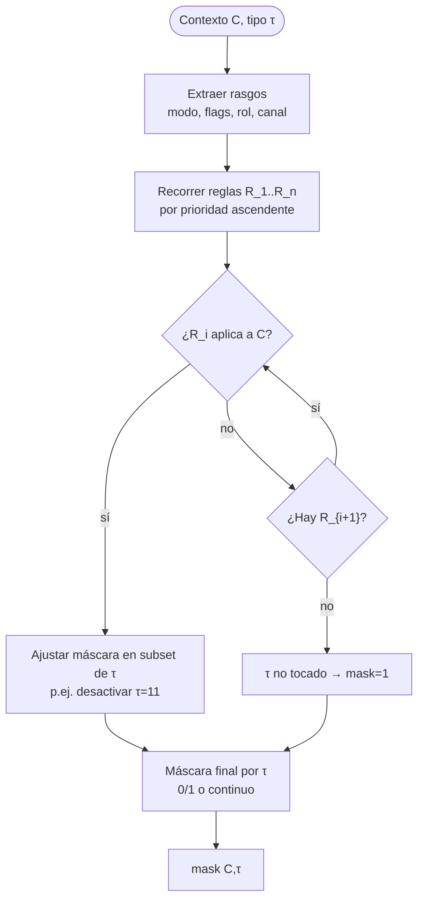
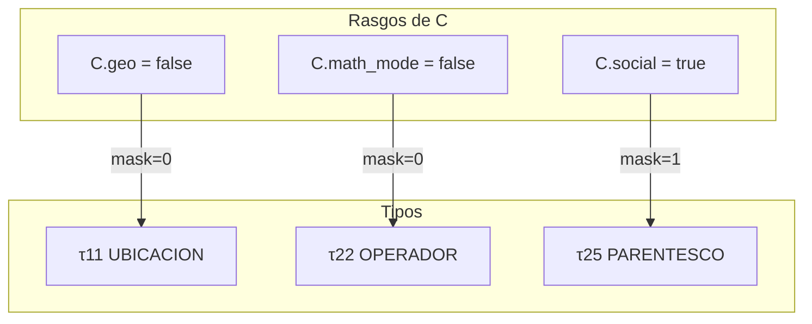
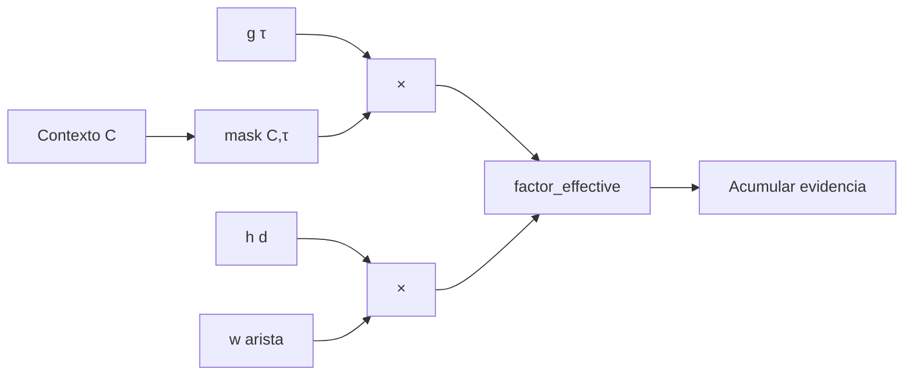

# mask(C, τ) — Activación de tipos de relación según contexto

**Qué controla:** qué canales `τ` participan en la propagación y en el scoring **dado el contexto C** (canal de chat, usuario menor, modo “solo FAQ”, sin geolocalización, idioma, etc.).

Valor típico: `mask(C, τ) ∈ {0, 1}` o en `[0,1]` para atenuación parcial.

---

## Algoritmo — Evaluación por capas

```
ENTRADA: contexto C (estructura JSON o registro), τ

1. EXTRAER rasgos de C:
   - modo: {chat, soporte, tutor, juego}
   - flags: {geo, math, social_graph, safety_strict, ...}
   - usuario: {edad, rol, ...} si aplica

2. REGLAS (lista ordenada por prioridad):
   para cada regla R_i en orden:
       si R_i.condicion(C) entonces
           aplicar R_i.accion sobre máscara τ
           // ej.: si not C.geo → mask(11)=0
           // ej.: si safety_strict → forzar revisión τ=10 aparte

3. DEFAULT:
   si ninguna regla fija mask(τ): mask(C,τ) ← 1

4. COMBINAR con g(τ):
   factor_effective(τ) = g(τ) * mask(C,τ)

SALIDA: mask(C, ·) como vector o función pura
```

---

## Diagrama 1 — Flujo interno de evaluación mask(C, τ)



---

## Diagrama 2 — Matriz conceptual (τ vs rasgo)

*(Ilustrativo; tus reglas concretas viven en configuración.)*



---

## Diagrama 3 — Orden de composición con g y h



---

## Pseudocódigo

```text
fun evaluar_mask(C, τ, reglas):
    m = 1.0
    para R en reglas_ordenadas:
        si R.cond(C) y τ en R.tipos_afectados:
            m = m * R.factor(C, τ)   // 0..1
    retornar m

fun factor_arista_total(g, C, τ, d, H):
    retornar g[τ] * evaluar_mask(C, τ, reglas) * H[d]
```

---

## Contratos

- **mask** no sustituye a **política valorativa (τ=10)** para seguridad fina; puede **desactivar** canales irrelevantes, mientras que τ=10 aporta juicio de prioridad ética (ver [`07_politica_tau_10.md`](07_politica_tau_10.md)).

---

## Implementación en Jasboot y Neurixis (2026)

- **Runtime:** el factor efectivo por arista ya combina `g(τ)` y `mask(C,τ)` en el núcleo JMN (`jmn_propagar_factor_arista` sobre `JMNPropagarExtra`: `g_tau[]`, `mask_tau[]`). Desde Jasboot: `configurar_mascara_g(tau, v)`, `configurar_mascaras_g("1,11,28", "1,0,1")`, `cargar_perfil_g` (reinicia vectores según perfil).
- **Neurixis:** `neurixis_aplicar_mask_contexto(modo)` en `apps/neurixis/modulos/generador.jasb` traduce un **modo textual** mínimo (sustituto de un JSON `C` completo) a llamadas nativas:
  - `"chat_sin_geo"` o cadena vacía: `mask(11)=0` (tipo **UBICACIÓN** desactivado en propagación; coherente con chat sin mapa).
  - `"con_geo"` o `"completo"`: `mask(11)=1`.
- **Diagrama 2 (τ vs rasgo):** el ejemplo “matemáticas → τ22” es solo ilustrativo del *patrón* “modo desactiva canal”; en el catálogo JMN actual los **operadores MIL** son **τ=28** (ver `TIPOS_RELACION_JMN.md`). Para apagar razonamiento aritmético en un modo “solo diálogo”, ajustaría `mask(28)` (y no confundir con τ=22 parentesco/social).
- **Extensión:** cuando exista un registro `C` (geo, math, tutor, …), sustituir el `si modo == …` por evaluación de reglas ordenadas como en el pseudocódigo de arriba; el contrato con la VM sigue siendo el vector `mask_tau[1..30]`.
