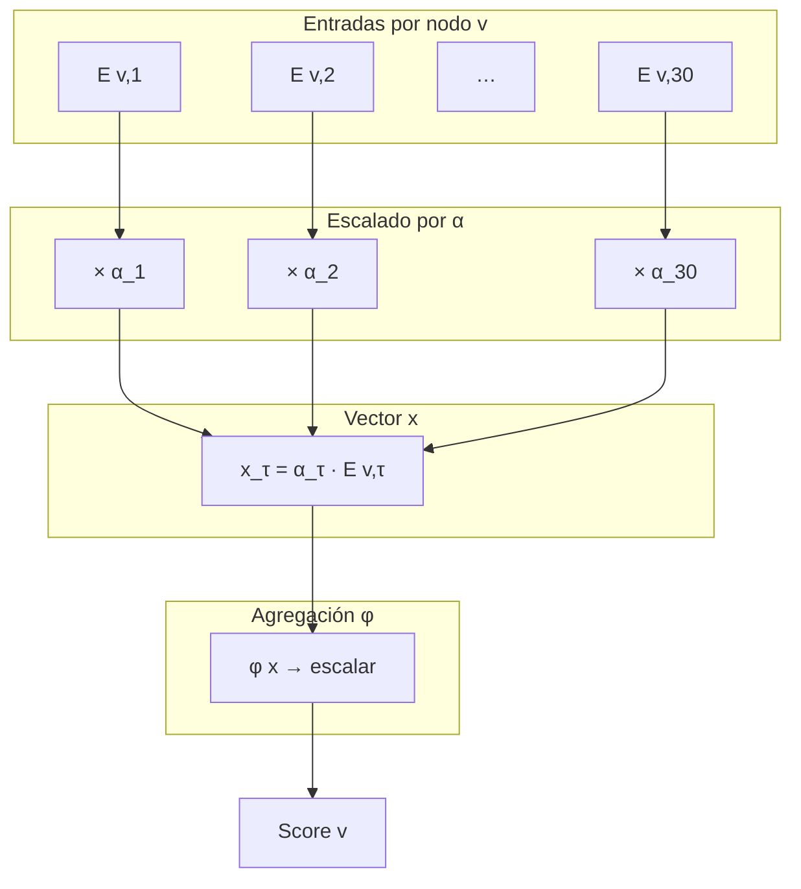
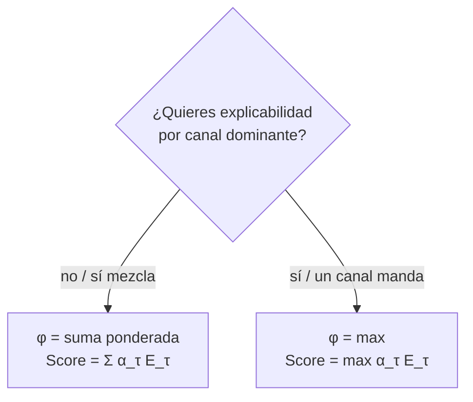

# α_τ y φ — Fusión de canales en un score escalar por nodo

**Qué controla:** cómo las evidencias **por tipo** `E[v,τ]` (o acumulados parciales) se combinan en un **único** `Score(v)` comparable entre nodos candidatos.

---

## Definición sugerida

- **E[v, τ]** — evidencia acumulada para el nodo `v` proveniente del tipo `τ` (suma de contribuciones `w · g(τ) · h(d) · mask` a lo largo de la propagación).
- **α_τ** — peso del canal `τ` en la **fusión final** (puede coincidir con `g(τ)` o ser distinto: `g` modula aristas; `α` modula cómo importa cada canal en el score global).
- **φ** — función agregadora: `ℝ^{30} → ℝ` (o de `ℝ^K` si agrupas tipos).

### Ejemplos de φ

1. **Ponderada lineal:** `Score(v) = Σ_τ α_τ · E[v,τ]`
2. **Máximo:** `Score(v) = max_τ (α_τ · E[v,τ])` (ganador por canal)
3. **Norma Lp:** `Score(v) = (Σ_τ (α_τ · E[v,τ])^p)^(1/p)`
4. **Dos etapas:** primero `φ_seq` solo sobre `τ∈{3,27,28}` (secuencia/acción/complemento), luego mezcla con el resto.

---

## Algoritmo — Tras cerrar la propagación

```
ENTRADA: para cada nodo v alcanzado, matriz E[v,1..30]; vectores α[1..30]; función φ

para cada v en candidatos:
    x[1..30] ← vector vacío
    para τ de 1 a 30:
        x[τ] ← α[τ] * E[v,τ]
    Score[v] ← φ(x)

opcional: normalizar scores entre 0 y 1 o aplicar softmax sobre {v}
```

---

## Diagrama 1 — Flujo interno: de E[v,·] a Score(v)



---

## Diagrama 2 — φ lineal vs φ max (decisión)



---

## Diagrama 3 — Pipeline completo hasta ranking


---

## Pseudocódigo

```text
fun fusionar_score(v, E, alpha, phi):
    x = vector[1..30]
    para τ en 1..30:
        x[τ] = alpha[τ] * E[v][τ]
    retornar phi(x)

// ejemplo phi lineal:
fun phi_lineal(x):
    s = 0
    para τ en 1..30:
        s = s + x[τ]
    retornar s
```

---

## Contratos

| Componente | Rol |
|------------|-----|
| `g(τ)` | Modula **cada arista** al propagar |
| `mask(C,τ)` | Apaga canales por **contexto** |
| `h(d)` | Apaga por **distancia** |
| `α_τ`, `φ` | Definen **competencia** entre canales al decidir `Score(v)` |

Separar `g` y `α` evita acoplar “importancia de arista” con “importancia en decisión final”.

---

## Estado en el runtime Jasboot (2026)

- **Matriz `E[v,τ]`:** la propagación nativa (`propagar_activacion`, `propagar_activacion_semillas`, etc.) acumula un **score escalar por nodo** a lo largo del BFS; **no** expone hoy a Jasboot una matriz densa `E[v,1..30]` por nodo candidato. La trazabilidad “qué τ dominó” pasa por auditoría opcional (`JASBOOT_PROPAGAR_AUDIT`, tests de estrés) o por inspección manual del grafo.
- **`α` separado de `g`:** en la VM actual, el peso por canal en arista viene de **`g(τ) · mask(C,τ) · h(d)`** (y el peso `w` de la arista). No hay un segundo vector **`α_τ`** aplicado solo en una fase de fusión post-BFS distinto de `g`; en la práctica **α y g están fusionados** en la contribución por arista salvo extensiones futuras del struct `JMNPropagarExtra`.
- **`φ` (agregación multi-canal):** el score final por nodo no ejecuta explícitamente `φ(α·E)` sobre 30 canales. Sí existe un modo de **acumulación entre rutas** vía entorno `JASBOOT_PROPAGAR_SCORE`: valor que empiece por `s` / `S` activa acumulación tipo **suma** sobre contribuciones concurrentes (útil para aproximar una mezcla más “lineal” entre caminos), frente al **máximo** por defecto. Ver `docs/LENGUAJE/jmn/PROPAGACION_D_MAX_K_AUDITORIA_Y_ESTRES.md` y `memoria_neuronal_cognitivo.c`.
- **Neurixis:** no implementa capa Π ni fusión φ avanzada en Jasboot; el ranking efectivo sigue al propagador + plantillas de secuencia (τ=3).

**Resumen:** los diagramas de este archivo describen el **objetivo de diseño**; la implementación nativa cubre bien **g, mask, h** y score escalar con opción suma/máx entre rutas. Para **φ por τ** y **α** independientes hace falta trabajo adicional en JMN/VM o una capa en la app que mantenga `E[v,τ]` explícita.
