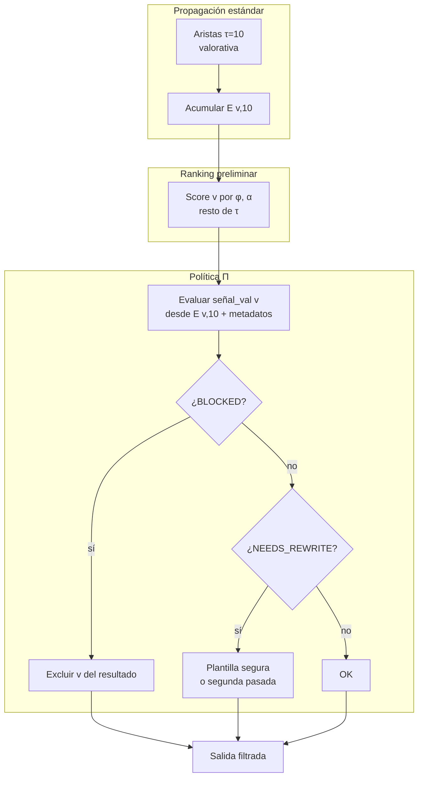
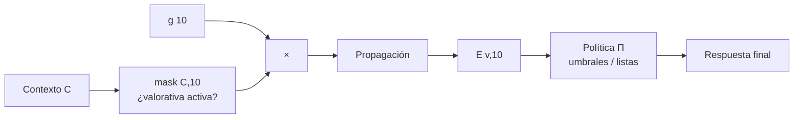
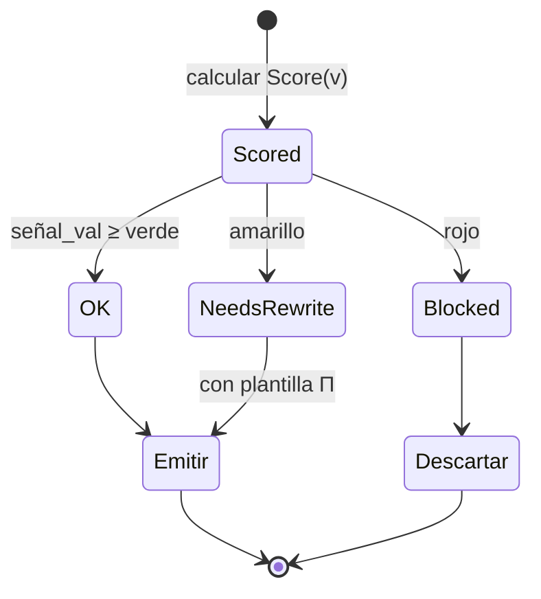

# Política sobre τ = 10 (VALORATIVA) — Tono, límites y seguridad

**Qué controla:** el tipo **10** (`JMN_RELACION_VALORATIVA` en el núcleo) modela **valoraciones** (éticas, de prioridad, de preferencia). La **política del producto** decide cómo ese canal **filtra, reordena o bloquea** respuestas antes de mostrarlas al usuario.

No sustituye a un modelo de moderación completo, pero es el **gancho semántico** en el grafo para “esto es aceptable / preferible / rechazable”.

---

## Algoritmo — Dos fases (grafo + guardarraíl)

### Fase A — Señal desde JMN (durante propagación)

```
Igual que otros τ:
   contribuir con aristas (u,v,10,w) usando g(10), h(d), mask(C,10)
   acumular E[v,10]
```

### Fase B — Política post-score (obligatoria en producción sensible)

```
ENTRADA: candidatos {v} con Score(v), evidencia E[v,10], política Π

para cada v en Top-K preliminar:
    señal_val ← agregar E[v,10] + reglas Π sobre etiquetas de v

    si señal_val < Π.umbral_rechazo:
        marcar v como BLOCKED
    si señal_val en [umbral_amarillo, umbral_verde):
        marcar v como NEEDS_REWRITE
    si señal_val ≥ umbral_verde:
        marcar v como OK

Post-proceso:
    eliminar BLOCKED del ranking
    opcional: reemplazar NEEDS_REWRITE por plantilla segura Π.fallback
```

---

## Diagrama 1 — Flujo interno de la política τ=10



---

## Diagrama 2 — Interacción con mask(C,10) y g(10)



---

## Diagrama 3 — Máquina de estados del candidato (auditoría)



---

## Pseudocódigo

```text
fun aplicar_politica_valorativa(v, E, Pi):
    s = combinar_E10_y_reglas(E[v][10], v, Pi)
    si s < Pi.umbral_rojo:
        retornar BLOQUEADO
    si s < Pi.umbral_verde:
        retornar REESCRIBIR(Pi.plantilla_amarilla)
    retornar PERMITIDO
```

---

## Contratos

- **τ=10** aporta **señal**; **Π** aporta **umbral y acción**. Sin Π, el modelo solo rankea pero no “garantiza” comportamiento seguro.
- Mantén **τ=10** también sujeto a **`mask(C,10)`** si en ciertos modos no quieres juicios valorativos automáticos (p. ej. modo depuración neutro).

---

## Referencia de tipos

Catálogo amplio: [`../docs/LENGUAJE/TIPOS_RELACION_JMN.md`](../docs/LENGUAJE/TIPOS_RELACION_JMN.md) (verificar coherencia numérica con `memoria_neuronal.h`).

---

## Neurixis y la VM hoy (2026)

- **Propagación:** las aristas **τ=10** se tratan como cualquier otro tipo respecto a `g(10)`, `mask(C,10)` y `h(d)`; no hay umbral Π que bloquee o reescriba respuestas después del ranking.
- **Neurixis:** no incluye aún la **máquina de estados** `OK` / `NEEDS_REWRITE` / `BLOCKED` ni lectura de `E[v,10]` para decisión de producto. La personalidad “ética” depende de la **semilla** (aristas valorativas) y del sesgo global `g`/`mask`; para producción sensible habría que añadir una función Jasboot post-`generar_*` (o servicio externo) que implemente Π sobre texto o sobre ids candidatos.
- **Depuración:** se puede forzar `mask(10)=0` en un modo “neutro” para apagar juicios valorativos automáticos en el grafo, sin sustituir moderación de contenido.
