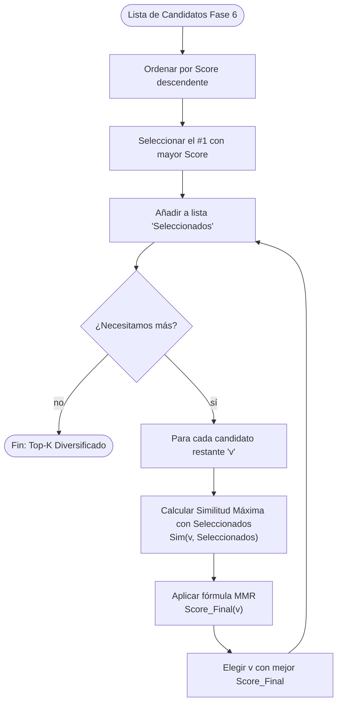

# Fase 8 — Ranking y Diversidad (MMR)

**Qué controla:** La selección final de los candidatos `v` después de la propagación, asegurando que la respuesta no sea redundante y cubra la mayor cantidad de información relevante posible.

***

## Objetivo

Evitar que la IA elija múltiples nodos que significan lo mismo (ej. "hola", "buenos días", "saludos") y forzar una selección que represente diferentes "ángulos" del conocimiento activado.

***

## Lógica Matemática del MMR

El algoritmo **Maximal Marginal Relevance** busca maximizar una función combinada entre relevancia y novedad.

### 1. Definición del Espacio

- Sea $V$ el conjunto de todos los nodos candidatos producidos por la Fase 6.
- Sea $S \subset V$ el conjunto de nodos ya seleccionados para la respuesta.
- Sea $R \subset V$ el conjunto de nodos restantes ($V \setminus S$).

### 2. Función Objetivo

Buscamos el siguiente nodo $v\_{next}$ tal que:

$$v\_{next} = \text{arg max}_{v \in R} \left\[ \lambda \cdot \text{Rel}(v) - (1 - \lambda) \cdot \max_{u \in S} \text{Sim}(v, u) \right]$$

Donde:

- $\text{Rel}(v)$: La relevancia del nodo (su **Score** normalizado entre 0 y 1).
- $\text{Sim}(v, u)$: La similitud entre el candidato $v$ y un nodo ya elegido $u$.
- $\lambda \in \[0, 1]$: Factor de balance.
  - Si $\lambda = 1$, la selección es puramente por relevancia (comportamiento actual).
  - Si $\lambda = 0$, la selección busca la máxima diversidad posible.

### 3. Cálculo de la Similitud $\text{Sim}(v, u)$

En la JMN, la similitud se calcula mediante el **Coseno de Adyacencia** sobre los vectores de relaciones:

$$\text{Sim}(v, u) = \frac{\mathbf{v} \cdot \mathbf{u}}{|\mathbf{v}| |\mathbf{u}|} = \frac{\sum\_{i} w\_{v,i} \cdot w\_{u,i}}{\sqrt{\sum\_i w\_{v,i}^2} \cdot \sqrt{\sum\_i w\_{u,i}^2}}$$

Donde $w\_{v,i}$ es el peso de la arista del nodo $v$ hacia el vecino común $i$. Si dos nodos comparten muchos vecinos con pesos similares, su similitud será cercana a 1.0.

***

## Algoritmo de Implementación

1. **Paso 0:** Normalizar todos los scores de los candidatos $V$ al rango $\[0, 1]$.
2. **Paso 1:** $S = { \text{arg max}\_{v \in V} \text{Rel}(v) }$. El primer nodo es siempre el de mayor score.
3. **Paso 2:** Mientras $|S| < K$ (donde $K$ es el número de respuestas deseadas):
   a. Calcular el valor MMR para cada $v \in R$.
   b. Seleccionar el $v$ con el valor máximo.
   c. Mover $v$ de $R$ a $S$.
4. **Paso 3:** Devolver la lista ordenada $S$.

***

## Diagrama 1 — Flujo de Selección Diversa

***

## Similitud Conceptual en JMN

¿Cómo sabe la IA que dos nodos son similares?

- **Tipo 4 (Similitud):** Si hay una arista directa de peso alto.
- **Coseno de Adyacencia:** Si comparten muchos vecinos del mismo tipo.
- **Distancia de Propagación:** Si uno activó al otro con un peso muy alto en la Fase 2.

***

## Contratos

| Entrada                | Salida                      |
| ---------------------- | --------------------------- |
| Lista `Top-N` (Fase 6) | Lista `Top-K` diversificada |

***

## Implementación en Jasboot (2026)

Esta fase se implementa típicamente en la capa de aplicación (como Neurixis) o como un post-procesador nativo en la VM si se activa el flag `IR_INST_FLAG_DIVERSIFY`.
