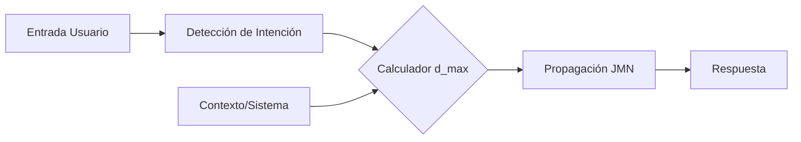

# Fase 9 — d_max Dinámico (Optimización de Profundidad)

**Qué controla:** Ajusta el límite de saltos (`d_max`) en tiempo real según la complejidad de la entrada, el contexto de la aplicación o los recursos disponibles.

---

## Objetivo

No desperdiciar CPU en preguntas simples (donde `d_max=1` basta) y permitir "soñar" o divagar más en preguntas filosóficas o creativas (donde `d_max=5+` es necesario).

---

## Lógica Matemática de la Modulación

El valor de $d_{max}$ se calcula como una función de tres variables: Complejidad ($X$), Contexto ($C$) y Energía ($E$).

### 1. Función de Complejidad $f(X)$
Calculamos la entropía o densidad de la entrada $L$ (lista de tokens):
$$X = \frac{\text{Tokens Útiles}}{\text{Longitud Total}} + \log(\text{Tokens Útiles} + 1)$$
Donde los tokens útiles son aquellos que existen en la JMN y no son funcionales.

### 2. Función de Contexto $g(C)$
Asignamos un valor numérico al modo de operación:
- Chat Trivial: $0.0$
- Tutor/Educativo: $1.0$
- Creatividad/Lluvia de ideas: $2.0$

### 3. Fórmula de d_max Adaptativo
$$d_{max}(X, C, E) = \lfloor d_{base} + \alpha \cdot X + \beta \cdot g(C) - \gamma \cdot (1 - E) \rfloor$$

Donde:
- $d_{base}$: Profundidad mínima (típicamente 1 o 2).
- $\alpha, \beta, \gamma$: Pesos de sintonización (hiperparámetros).
- $E \in [0, 1]$: Disponibilidad de recursos (CPU/Batería).

**Restricción Estricta:**
$$1 \le d_{max} \le 32$$
(El límite de 32 es una constante de estabilidad del núcleo JMN).

---

## Algoritmo de Implementación

---

## Ventajas

- **Latencia:** Respuestas de saludo instantáneas.
- **Riqueza:** Descubrimiento de asociaciones no obvias en modos de "lluvia de ideas".
- **Estabilidad:** Evita que el grafo "explote" en nodos muy conectados si no es necesario.

---

## Implementación en Neurixis

Implementado en `activar_propagacion_contextual` mediante la variable `d_max_ext` ajustada según el tipo de intención.
