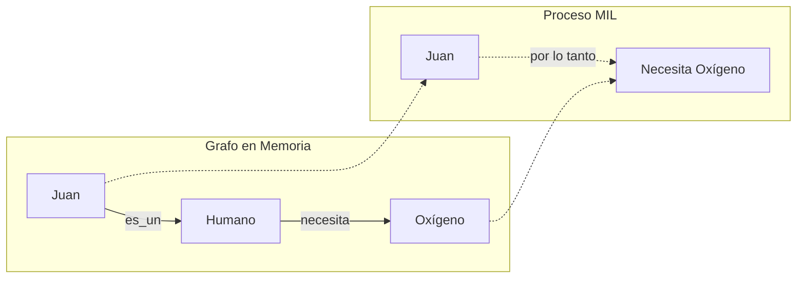

# Fase 10 — Inferencia Simbólica (MIL Multi-paso)

**Qué controla:** La capacidad de la IA para realizar deducciones lógicas encadenadas que no están presentes de forma explícita en el grafo.

---

## Objetivo

Pasar de la simple asociación ("A está cerca de B") al razonamiento estructural ("Si A → B y B → C, entonces A → C").

---

## Lógica Matemática de la Inferencia

La inferencia simbólica en la JMN se modela como la búsqueda de un **Camino de Conexión Lógica** entre premisas, donde la confianza de la conclusión decae con cada salto.

### 1. Cálculo de Confianza de la Ruta ($C_R$)
Sea una cadena de deducción $u \xrightarrow{\tau_1, w_1} v \xrightarrow{\tau_2, w_2} z$. La confianza final en que $u$ tiene una relación implícita con $z$ es:

$$C_R(u, z) = \prod_{i=1}^{n} (w_i \cdot \delta(\tau_i))$$

Donde:
- $w_i$: Peso de la arista física en el grafo.
- $\delta(\tau_i) \in [0, 1]$: **Factor de Coherencia Logica** del tipo de relación. 
    - Por ejemplo, la relación de *Instancia* ($\tau=16$) transmite mucha confianza ($\delta \approx 1.0$).
    - Una relación de *Asociación Simple* ($\tau=1$) transmite poca confianza lógica ($\delta \approx 0.3$).

### 2. Operadores de Inferencia
- **Transitividad (AND):** $A \implies B \land B \implies C \implies A \implies C$. Se resuelve multiplicando confianzas.
- **Convergencia (OR):** Si hay múltiples caminos de inferencia hacia la misma conclusión, usamos la suma probabilística:
  $$C_{final} = 1 - \prod (1 - C_{path,j})$$

### 3. El Filtro de Contradicción
Antes de emitir una inferencia, se comprueba la existencia de una relación de **Oposición ($\tau=5$)** en el grafo.
Si $C_{R}(u, z) > 0$ pero existe una arista directa $u \xrightarrow{\tau=5} z$ con peso $w_{neg}$, la inferencia se anula si $w_{neg} > C_{R}$.

---

## Tipos de Inferencia en JMN

---

## Algoritmo de Inferencia Encadenada

1. **Detectar Premisas:** Identificar nodos activados con alta confianza.
2. **Expandir Caminos Semánticos:** Buscar rutas que conecten premisas a través de verbos lógicos (ser, tener, pertenecer).
3. **Validar Consistencia:** Comprobar que no existan relaciones de **Oposición (Tipo 5)** en la ruta.
4. **Emitir Conclusión:** Crear una arista efímera (en la sesión actual) que represente la deducción.

---

## Diferencia con el Razonamiento Humano

Esta fase permite que la IA "entienda" jerarquías y reglas, acercándose al razonamiento formal. Sin esto, la IA es solo un buscador de palabras relacionadas.
