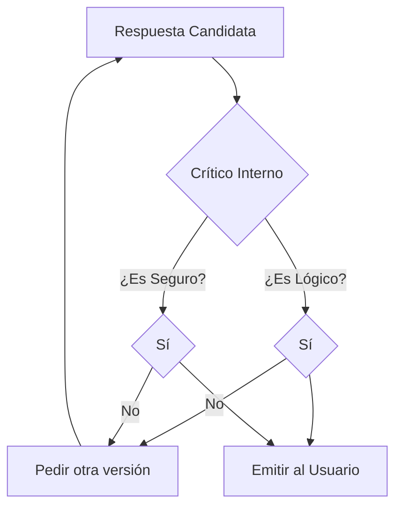

# Fase 11 — Metacognición y Simulación

**Qué controla:** El proceso de autocrítica y revisión interna antes de que la IA emita una respuesta al usuario. Es el equivalente a "pensar antes de hablar".

---

## Objetivo

Eliminar alucinaciones, contradicciones y respuestas fuera de tono. Asegurar que la respuesta generada por las fases anteriores cumple con los objetivos de la IA.

---

## Lógica Matemática del Crítico Interno

La metacognición se implementa como una **Función de Coste Multi-objetivo** que evalúa una respuesta candidata $A$ frente a un conjunto de restricciones.

### 1. Función de Puntuación Meta ($S_{meta}$)

$$S_{meta}(A) = \sum_{k} \omega_k \cdot E_k(A)$$

Donde:

- $E_k(A) \in [0, 1]$: Evaluador individual para la dimensión $k$.
- $\omega_k$: Importancia de esa dimensión para la personalidad de la IA.

### 2. Dimensiones de Evaluación ($E_k$)

- **Coherencia ($E_{coh}$):** Calcula la activación promedio de los nodos en $A$ respecto al contexto actual $C$.
- **Seguridad ($E_{safe}$):** Inversa de la señal del canal $\tau=10$ (valorativa) detectada en la respuesta.
- **Concisión ($E_{len}$):** Penaliza respuestas que exceden el límite de tokens útiles sin aportar información nueva.

### 3. El Umbral de Emisión ($\Theta$)

La IA solo emite la respuesta si:
$$S_{meta}(A) \ge \Theta$$

Si $S_{meta}(A) < \Theta$, se dispara un evento de **Re-planificación**, donde se ajustan los pesos $g(\tau)$ para evitar las ramas del grafo que llevaron a esa respuesta fallida.

---

## El Bucle de Simulación Interna

En lugar de una respuesta directa, la IA realiza:

1. **Generación de Candidatos:** Fase 7 produce 3 posibles respuestas.
2. **Simulación de Impacto:** La IA "se pregunta a sí misma" qué pasaría si dice la respuesta A.
   - ¿Contradice algo que dije antes? (Memoria Episódica).
   - ¿Viola alguna política ética? (Fase 8).
   - ¿Es gramaticalmente correcta?
3. **Puntuación de Confianza:** Un clasificador interno puntúa cada respuesta simula.
4. **Emisión o Re-intento:** Si la puntuación es baja, se vuelve a la Fase 6 con un `mask` diferente para buscar otra ruta.

---

## Diagrama 1 — El "Espejo" Cognitivo

---

## Diferencia Clave

- **Sin Metacognición:** La IA dice lo primero que activa sus neuronas (comportamiento de "Neurixis actual").
- **Con Metacognición:** La IA tiene un "Yo" observador que regula el flujo de pensamiento.

---

## Implementación Futura

Requiere una **Memoria de Trabajo** (Working Memory) que actúe como un _sandbox_ donde las neuronas pueden activarse sin consolidar cambios en la memoria permanente.
