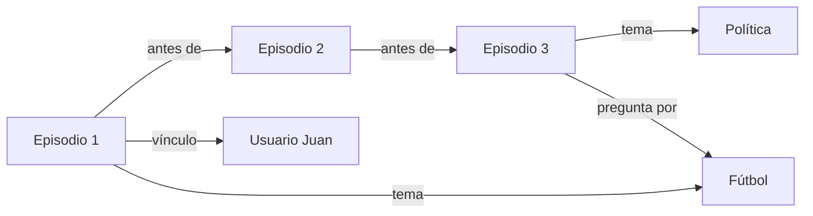

# Fase 12 — Memoria Episódica y Temporal

**Qué controla:** El registro de eventos en una línea de tiempo y la capacidad de referenciar el pasado de la conversación de forma estructurada.

---

## Objetivo

Evitar que la IA viva en un "eterno presente". Permitir que sepa quién es el usuario, qué se discutió hace 10 turnos y cómo ha evolucionado el contexto.

---

## Lógica Matemática del Recuerdo

La memoria episódica utiliza una función de **Decaimiento Temporal** para priorizar los recuerdos recientes sobre los antiguos.

### 1. El Factor de Recencia ($R_t$)

Cada nodo de episodio $E_i$ tiene una marca de tiempo $T_i$. El peso de activación de un recuerdo en el momento actual $T_{now}$ es:

$$R_t(E_i) = e^{-\alpha \cdot (T_{now} - T_i)}$$

Donde $\alpha$ es la constante de olvido. Si $\alpha$ es alta, la IA olvida rápido; si es baja, tiene una memoria persistente a largo plazo.

### 2. Activación Combinada ($A_{episodio}$)

Un recuerdo se recupera si su activación supera un umbral. La activación total de un episodio $E_i$ dada una entrada $L$ es:

$$A_{total}(E_i) = \omega_{rec} \cdot R_t(E_i) + \omega_{sem} \cdot \text{Sim}(E_i, L)$$

Donde:

- $\text{Sim}(E_i, L)$: Similitud semántica entre el episodio y el texto actual.
- $\omega_{rec}, \omega_{sem}$: Pesos que balancean si importa más que sea reciente o que sea relevante.

### 3. Homeostasis de Memoria

Para evitar la saturación del grafo, se aplica una función de poda (Pruning) basada en la importancia acumulada:
$$I(E_i) = \int_{T_i}^{T_{now}} A_{total}(E_i, t) dt$$
Si $I(E_i) < \epsilon$, el nodo de episodio y sus aristas se eliminan físicamente de la JMN.

---

## Estructura de Episodios en JMN

En lugar de nodos puramente conceptuales ("Perro"), se crean **Nodos de Episodio**:

- `E_20260516_1430`: Representa un momento en el tiempo.
- Se vincula a conceptos mediante **Tipo 29 (Situación)**.
- Se vincula al usuario mediante **Tipo 25 (Vínculo)**.

---

## Diagrama 1 — La Línea de Tiempo Neuronal

---

## Algoritmo de Recuperación de Memoria

1. **Activación por Recencia:** Los episodios más cercanos en el tiempo tienen un factor `h(t)` más alto.
2. **Activación por Relevancia:** Si hablas de "Fútbol", los episodios antiguos relacionados con ese deporte se activan por asociación de segundo grado.
3. **Consolidación:** Al final de la sesión, los episodios menos importantes se degradan (olvido) y los importantes se fusionan con el conocimiento general.

---

## Implementación

Requiere el uso de **Timestamps** en los metadatos de los nodos JMN y un proceso de "Homeostasis" que limpie nodos episódicos irrelevantes para evitar el crecimiento infinito de la base de datos.
