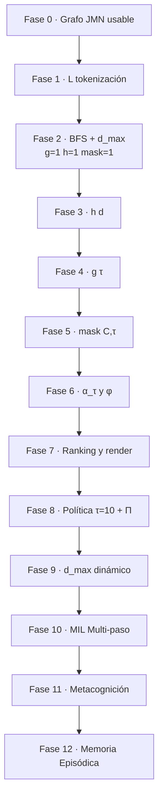

# Orden recomendado de implementación de algoritmos (pipeline grafo + contexto)

Este documento amplía el **orden por dependencias** que conviene seguir al construir el motor de predicción (tokenización **L**, propagación con **d_max**, **h(d)**, **g(τ)**, **mask(C,τ)**, fusión **α_τ / φ**, política sobre **τ=10**). Está alineado con los diagramas en [`01_tokenizacion_L.md`](01_tokenizacion_L.md)–[`07_politica_tau_10.md`](07_politica_tau_10.md) y con el modelo global en [`../docs/LENGUAJE/MODELO_MENTAL_Y_FLUJO_PREDICCION_JMN.md`](../docs/LENGUAJE/MODELO_MENTAL_Y_FLUJO_PREDICCION_JMN.md).

**Principios:**

1. **Una variable nueva por iteración** — mientras depuras BFS, no actives mask dinámico ni φ no lineal a la vez.
2. **Grafo toy acotado** — cada fase debe tener un `.jasb` o test con 5–15 nodos donde el resultado esperado se calcule a mano.
3. **Contratos explícitos** — fija si la profundidad `d` es del **origen** o del **destino** de la arista y documéntalo una sola vez (recomendación: `d_v` en el destino al acumular en `v`).
4. **Medir antes de optimizar** — contadores de aristas visitadas, nodos encolados, tiempo por turno; `d_max` y `h` existen para acotar explosión combinatoria.

---

## Vista de dependencias (orden lógico)

---

## Fase 0 — Grafo JMN operativo (**nativo en Jasboot**)

**Objetivo:** crear/leer memoria, definir aristas `(tipo τ, peso w)` y obtener **vecinos de un salto** desde un concepto, usando **primitivas del lenguaje** (compilador + VM + JMN), sin capa intermedia en script para el acceso al grafo.

### Primitivas nativas relevantes

| Necesidad | Primitiva Jasboot | Notas |
|-----------|-------------------|--------|
| Abrir / crear `.jmn` | `crear_memoria(ruta)` | También flujos con `abrir_memoria` según tu app. |
| Arista tipada + peso | `asociar_relacion(c1, c2, τ, p)` | `τ` en `1..30`, `p` en `0.0..1.0`. |
| Mejor un solo asociado | `buscar_asociados(origen, τ)` | Devuelve id (vía `resultado` / registro según uso). |
| Lista de vecinos (1 salto, mismo núcleo que `jmn_buscar_asociaciones` prof. 1) | `buscar_asociados_lista(origen, K, τ)` | Comportamiento histórico. |
| **Alias explícito Fase 0** | `vecinos_jmn(origen, K, τ)` | **Mismo opcode** que `buscar_asociados_lista`; nombre alineado con el modelo `flujo_model_IA`. |
| Variante MAI (máscara de tipos) | `vecinos_jmn_mai(...)` | Igual que `buscar_asociados_lista_mai` (flag `RELATIVE` en la VM). |
| Alias legible | `conexiones_salientes_de(origen, K, τ)` | Igual que `asociados_lista_de` / lista de salidas. |
| Fuerza entre dos ids | `buscar_peso(c1, c2)` | Para leer `w` en aristas concretas. |

Los **pesos por arista** devueltos en la lista siguen el ordenamiento interno de la VM (`OP_MEM_BUSCAR_ASOCIADOS_LISTA`); la lista expuesta a Jasboot contiene **ids de destino** (como con `buscar_asociados_lista`). Para `(v, w)` explícito por par, usa `lista_obtener` + `buscar_peso(origen, id_v)` en Jasboot o amplía el runtime en una iteración futura.

**Entregables (DoD Fase 0):**

- Programa mínimo que: abre memoria, crea 2 aristas desde un nodo, llama `vecinos_jmn` y comprueba `lista_tamano` ≥ 2.
- Regresión: `sdk-dependiente/jas-compiler-c/tests/test_vecinos_jmn.jasb`.

**Pruebas:**

- Ejecutar: `node .vscode/run-jasb.cjs sdk-dependiente/jas-compiler-c/tests/test_vecinos_jmn.jasb` (debe imprimir tamaño 2 para ambos alias).

**Riesgos:** confundir **profundidad de búsqueda interna** (`jmn_buscar_asociaciones(..., profundidad)`) con **`d_max` del pipeline** de predicción (Fase 2): Fase 0 solo garantiza **acceso nativo al grafo local**; el BFS multi-hop del documento de algoritmos lo implementas en capa superior o con `propagar_activacion` según diseño.

**Referencia:** constantes `JMN_RELACION_*`, `JMN_RELACION_MAX` en `jasboot-jmn-core` / `memoria_neuronal.h`.

---

## Fase 1 — L: normalización y tokenización

**Objetivo:** `T, O → L` (lista de claves candidatas a activar nodos).

**Entregables:**

- Pipeline: Unicode → política de mayúsculas → delimitadores → tokens → (opcional) n-gramas → filtros (`min_len`, stopwords).
- Tabla de **mapeo token → id/nodo** o política “si no existe nodo, ignorar / crear efímero”.

**Criterios de hecho (DoD):**

- Mismo `T` con espacios dobles o bordes produce el mismo `L` (estabilidad).
- `O` documentado: idioma, delimitadores, si se usa casefold.

**Pruebas:**

- Casos: cadena vacía, una palabra, puntuación pegada (`hola,`), contracción si aplica a tu locale.
- Medir tamaño de `L` en mensajes largos (riesgo de activar demasiadas semillas).

**Detalle:** ver [`01_tokenizacion_L.md`](01_tokenizacion_L.md).

---

## Fase 2 — Propagación con d_max solamente (baseline)

**Objetivo:** BFS (o DFS acotada) desde semillas `S₀` derivadas de `L`, con **corte duro** `d_v ≤ d_max`, sin aún matizar por tipo.

**Configuración fija temporal:**

- `g(τ) = 1` para todo τ.
- `h(d) = 1` para todo `d`.
- `mask(C,τ) = 1` para todo τ.

**Acumulación mínima:**

- Por ejemplo `Score_tmp(v) += w` sumando todas las aristas válidas que llegan a `v` en la expansión, o solo contar primer alcance.

**Criterios de hecho:**

- Ningún nodo encolado con `d > d_max`.
- `dist[v]` es el mínimo `d` observado si exploras múltiples rutas.

**Pruebas:**

- Cadena lineal de nodos de longitud 10: con `d_max=2` solo deben alcanzarse semilla + 2 saltos.
- Grafo con ciclo: la cola no debe divergir infinitamente; visitados + `dist` mínimo deben acotar.

**Detalle:** ver [`02_d_max.md`](02_d_max.md).

---

## Fase 3 — h(d): penalización por distancia

**Objetivo:** tabla `H[0..d_max]` (precomputada) y multiplicar cada contribución por `H[d_v]` (o la convención que fijaste en Fase 2).

**Entregables:**

- Una familia de `h` (recomendación inicial: exponencial `λ^d` o `1/(1+κd)`).
- Tests unitarios: `h(0)=1`, `h(d)` no creciente, `h(d>d_max)` no usado en nodos no encolados.

**Criterios de hecho:**

- Con el mismo grafo que Fase 2, los nodos lejanos bajan en score relativo sin cambiar el conjunto alcanzable (solo pesos).

**Detalle:** ver [`04_h_d.md`](04_h_d.md).

---

## Fase 4 — g(τ): peso global por tipo

**Objetivo:** vector `g[1..30]` aplicado a **cada arista** según su τ.

**Entregables:**

- Carga desde perfil / JSON (`g_default` + overrides).
- Opcional: normalización (`max g = 1`).

**Criterios de hecho:**

- Cambiar solo `g(3)` (secuencia) y verificar que en un grafo toy la preferencia de “siguiente palabra” se desplaza sin tocar `d_max` ni `h`.

**Pruebas:**

- Arista única con distintos τ y mismos `w`; la contribución debe escalar con `g(τ)`.

**Detalle:** ver [`03_g_tau.md`](03_g_tau.md).

---

## Fase 5 — mask(C, τ): contexto modula tipos

**Objetivo:** función pura `(C, τ) → [0,1]` (o booleano) evaluada **antes** de acumular.

**Entregables:**

- Objeto `C` mínimo: `modo`, `flags` (`geo`, `math`, `safety_strict`, …).
- Lista de reglas **ordenada por prioridad** (la primera regla que fija un τ gana, o composición multiplicativa documentada).

**Criterios de hecho:**

- Mismo grafo y mismas semillas: cambiar solo un flag en `C` altera el subconjunto de τ activos de forma reproducible.

**Pruebas:**

- `mask(C,11)=0` cuando `C.geo=false` y aristas 11 presentes en el grafo toy: no deben aportar evidencia.

**Detalle:** ver [`05_mask_C_tau.md`](05_mask_C_tau.md).

---

## Fase 6 — α_τ y φ: matriz de evidencia → score escalar

**Objetivo:** mantener `E[v,τ]` por separado durante la propagación; al cerrar la expansión, `Score(v) = φ({α_τ·E[v,τ]})`.

**Entregables:**

- Estructura `E` dispersa o densa para `v` candidatos.
- Primera implementación de **φ lineal** (`Σ α_τ E[v,τ]`); dejar `max` o Lp como mejora.

**Criterios de hecho:**

- Puedes **explicar** qué canal τ dominó el score de un `v` concreto (trazabilidad mínima para depuración).

**Pruebas:**

- Dos nodos con misma suma ponderada pero distinta distribución por τ; si usas `φ=max`, el ganador debe cambiar respecto a la suma.

**Detalle:** ver [`06_alpha_phi.md`](06_alpha_phi.md).

---

## Fase 7 — Ranking, Top-K y render a texto

**Objetivo:** ordenar candidatos, aplicar desempates, diversidad opcional (MMR), y mapear nodo → plantilla de respuesta / fragmento generado.

**Entregables:**

- `TopK(Score)` estable ante empates (orden secundario por τ preferido o por hash de id).
- Capa de **plantillas** o “actos de diálogo” si no generas lenguaje libre aún.

**Criterios de hecho:**

- Latencia predecible: límite de candidatos o poda antes de ordenar todo el grafo alcanzado.

---

## Fase 8 — Política valorativa (τ=10) + Π post-score

**Objetivo:** después del ranking, aplicar umbrales / listas / reescritura segura usando señal de **τ=10** y reglas Π.

**Entregables:**

- Estados `OK` / `NEEDS_REWRITE` / `BLOCKED` con telemetría (contadores).
- **No** uses Π para enmascarar bugs de BFS: los tests de fases 2–6 deben seguir pasando sin Π.

**Detalle:** ver [`07_politica_tau_10.md`](07_politica_tau_10.md).

---

## Fase 9 — d_max dinámico (opcional, al final)

**Objetivo:** `d_max := f(C)` o `clamp(d_default + Δ(C), d_min, d_cap)` al inicio de cada turno.

**Entregables:**

- Tabla de modos → `d_max` o función suave acotada.
- Regresión: mismo `C` siempre produce el mismo `d_max` (determinismo).

**Riesgo:** oscilación entre turnos; define histéresis si el usuario alterna modos rápido.

---

## Pista en paralelo (no bloquea L–BFS): memoria episódica con fecha

Puede desarrollarse **en paralelo** tras la Fase 0–1 si tienes recursos, pero **no** mezcles su lógica dentro del BFS hasta que el propagador sea estable.

**Idea:** nodos de episodio (`turno_iso8601_usuario`), aristas tipo **8** (temporalidad entre episodios), **25** (vínculo con interlocutor), **29** (situación), **3** (orden de enunciados). Las **fechas legibles** viven en el **texto del nodo** o en metadatos que tú persistes; JMN prioriza grafo + peso, no un CRM conversacional listo.

---

## Tabla resumen (orden, artefacto, doc)

| Orden | Fase | Artefacto principal | Documento |
|:-----:|------|----------------------|-----------|
| 0 | Grafo JMN | API vecinos / memoria | `memoria_neuronal.h`, tests JMN |
| 1 | L | Tokenizador | [`01_tokenizacion_L.md`](01_tokenizacion_L.md) |
| 2 | BFS | Cola + `d_max`, baseline | [`02_d_max.md`](02_d_max.md) |
| 3 | h | Tabla `H[d]` | [`04_h_d.md`](04_h_d.md) |
| 4 | g | Vector `g[τ]` | [`03_g_tau.md`](03_g_tau.md) |
| 5 | mask | Reglas sobre `C` | [`05_mask_C_tau.md`](05_mask_C_tau.md) |
| 6 | α, φ | Fusión `Score(v)` | [`06_alpha_phi.md`](06_alpha_phi.md) |
| 7 | Salida | Top-K + render | MODELO mental + tu app |
| 8 | Π | Política τ=10 | [`07_politica_tau_10.md`](07_politica_tau_10.md) |
| 9 | d_max(C) | Override contextual | [`02_d_max.md`](02_d_max.md) + este doc |

---

## Estado en el monorepo (mayo 2026)

| Fase | Estado breve | Dónde comprobar |
|:----:|--------------|-----------------|
| P0–P2 | Estable (JMN, L, propagación con `d_max` / `K`) | VM + tests JMN / `propagar_*` |
| P3 | Estable | `JASBOOT_PROPAGAR_H_*`, `04_h_d.md` |
| P4 | Estable + perfil en VM | `configurar_peso_g`, `cargar_perfil_g`, Neurixis `neurixis_pipeline_g_tau_ara` |
| P5 | **Parcial:** máscaras globales + **Neurixis:** `neurixis_aplicar_mask_contexto` (modo texto → `mask(11)`; extensible a más τ) | `05_mask_C_tau.md`, `apps/neurixis/modulos/generador.jasb` |
| P6 | **Parcial:** sin `E[v,τ]` expuesta; `α` acoplado a arista vía `g·mask`; `JASBOOT_PROPAGAR_SCORE` suma vs máx entre rutas | `06_alpha_phi.md`, `memoria_neuronal_cognitivo.c` |
| P7 | App (Neurixis: secuencias τ=3, plantillas) | `apps/neurixis/` |
| P8 | **Diseño + semilla**; **sin** Π post-score en Neurixis | `07_politica_tau_10.md` |
| P9 | Parcial (p. ej. `d_max_ext` por intención en Neurixis) | `generador.jasb` `activar_propagacion_contextual` |

**Semilla por tipo 1–30 (plantilla + guía):** `apps/neurixis/datos/semilla_plantilla_tipos_1_30.txt`, `apps/neurixis/docs/GUIA_SEMILLA_POR_TIPO_JMN.md`.

---

## Checklist rápida antes de pasar de fase

- [ ] Tests toy verdes con datos fijos.
- [ ] Logs o trazas: semillas `S₀`, tamaño de cola máximo, nodos únicos visitados.
- [ ] Documento de convención: dirección de aristas, significado de `d`, uso de `d_v` en `h`.
- [ ] Ninguna fase nueva activada hasta congelar la anterior.

---

## Referencias cruzadas

- Modelo global + diagrama 1: [`../docs/LENGUAJE/MODELO_MENTAL_Y_FLUJO_PREDICCION_JMN.md`](../docs/LENGUAJE/MODELO_MENTAL_Y_FLUJO_PREDICCION_JMN.md)
- Arquitectura JMN + MAI + disco: [`../docs/DIAGRAMA_COMPLETO_CONEXIONES_NEURONALES.md`](../docs/DIAGRAMA_COMPLETO_CONEXIONES_NEURONALES.md)
- Índice de diagramas por bloque: [`README.md`](README.md)

---

*Última actualización: documento de orden de implementación ampliado para el directorio `flujo_model_IA/`.*
